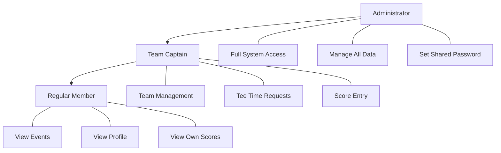
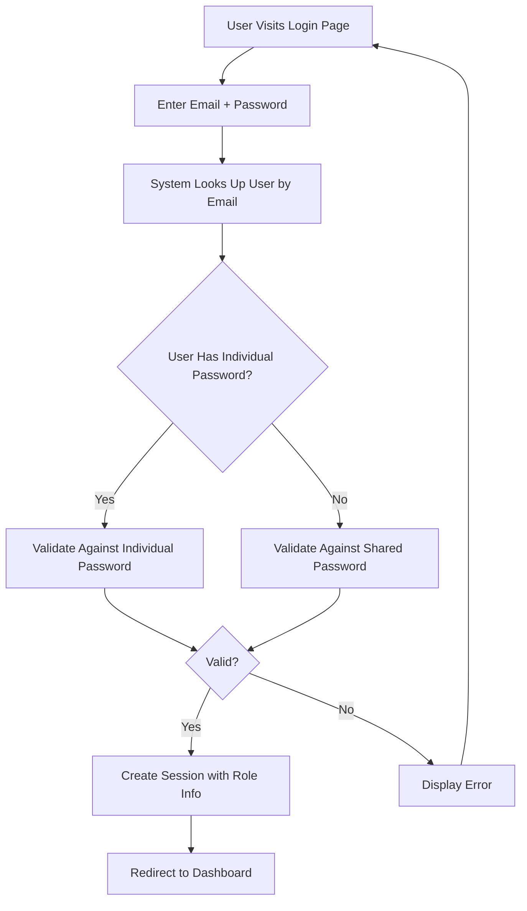
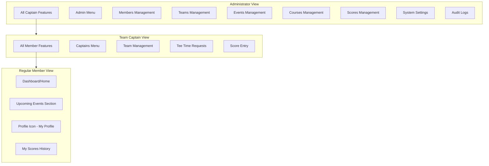
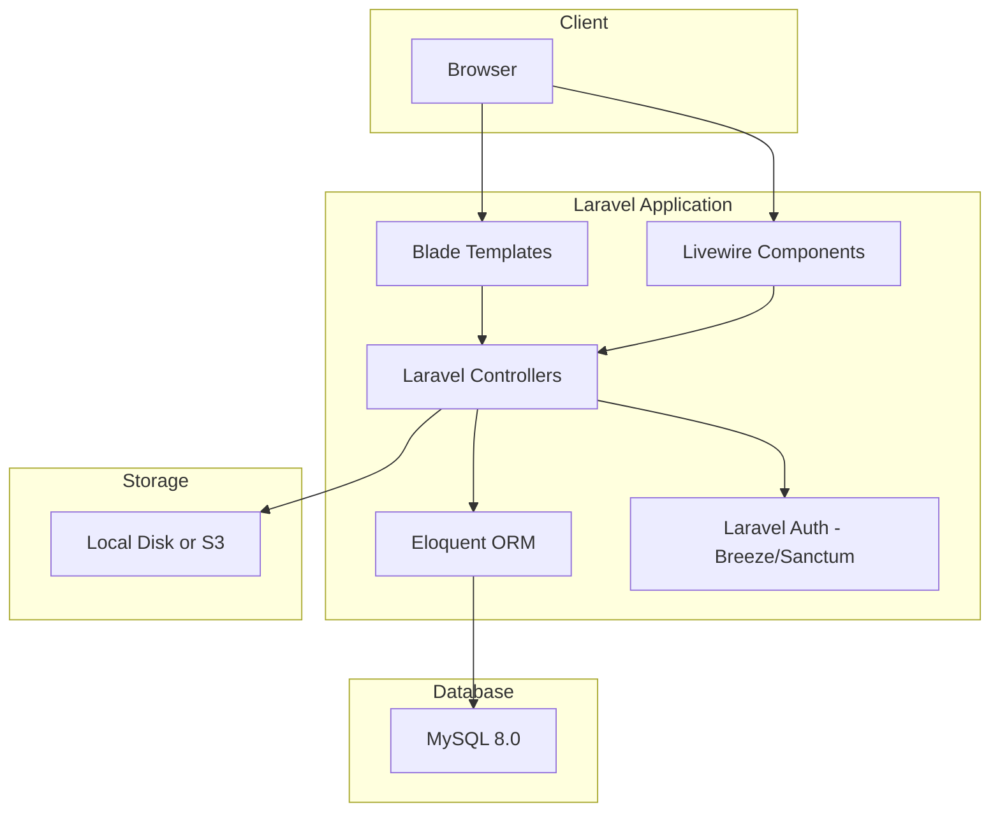
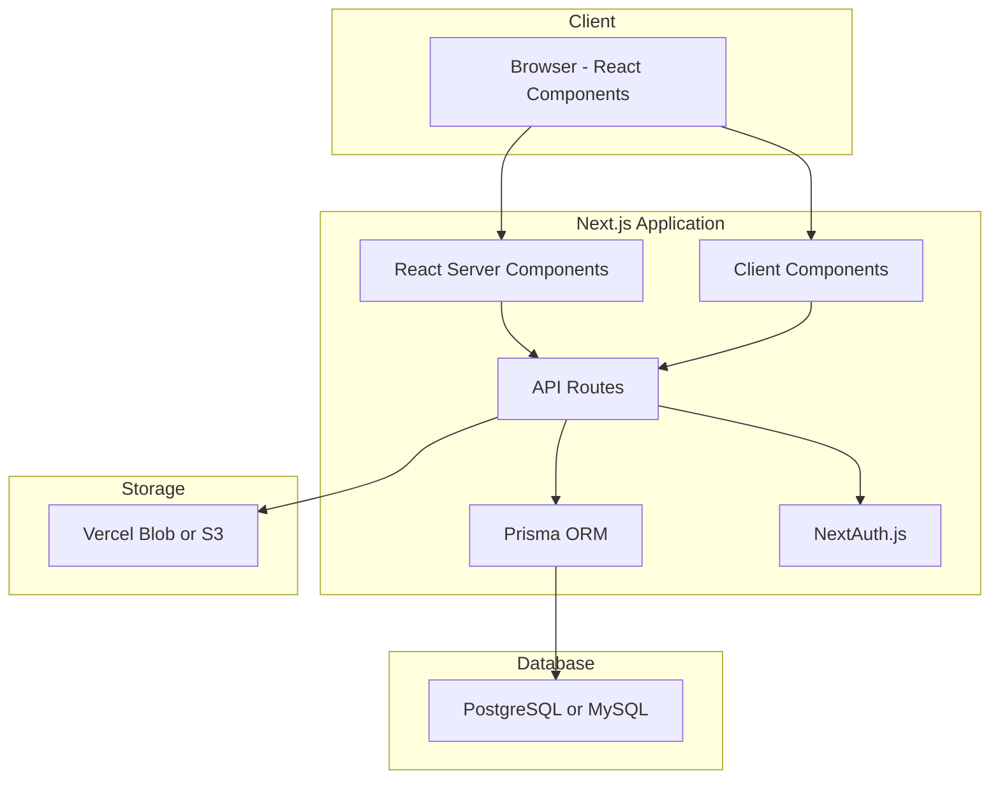

# MCSGA Golf Association Portal
## Application Specification and Requirements Document

**Version:** 1.5
**Date:** February 3, 2026
**Status:** Draft

---

## Table of Contents

1. [Executive Summary](#1-executive-summary)
2. [User Roles and Authentication](#2-user-roles-and-authentication)
3. [Database Schema](#3-database-schema)
4. [User Interface and Navigation](#4-user-interface-and-navigation)
5. [Forms and CRUD Operations](#5-forms-and-crud-operations)
6. [Special Reports](#6-special-reports)
7. [Audit Logging](#7-audit-logging)
8. [Non-Functional Requirements](#8-non-functional-requirements)
9. [Technology Stack Options](#9-technology-stack-options)
10. [Future Enhancements](#10-future-enhancements)

---

## 1. Executive Summary

### 1.1 Purpose

The MCSGA Golf Association Portal is a web-based application designed to serve as a central hub for members of the MCSGA golf association. The portal provides information about upcoming golf events, manages member and team data, and facilitates score tracking for golf outings.

### 1.2 Key Features

- **Event Management**: Display and manage upcoming golf outing events with course details
- **Member Management**: Maintain member profiles and team assignments
- **Team Organization**: Group members into teams with designated team captains
- **Score Tracking**: Record and report golf scores for events
- **Tee Time Coordination**: Allow captains to request tee times and administrators to assign them
- **Role-Based Access**: Three-tier permission system (Administrator, Team Captain, Member)

### 1.3 Target Users

- Golf association administrators
- Team captains
- Regular members of the MCSGA

---

## 2. User Roles and Authentication

### 2.1 User Role Hierarchy



### 2.2 Role Definitions

#### 2.2.1 Administrator
- **Access Level**: Full system access
- **Authentication**: Individual email and password
- **Capabilities**:
  - View and edit all pages/sections of the website
  - Manage all database tables (Members, Teams, Events, Courses, Scores)
  - Set and update the shared member password
  - Assign team captain privileges to members
  - Assign tee times to teams for events
  - View all audit logs
  - Manage course photos (via URL entry) and information

#### 2.2.2 Team Captain
- **Access Level**: Elevated member privileges
- **Authentication**: Individual email and password
- **Capabilities**:
  - All regular member capabilities
  - Register their team for events (selecting participating members and guests)
  - Manage team roster (add/remove members)
  - Request tee times for upcoming events
  - Enter golf scores for participating team members and guests at events
  - View team-specific reports

> **Note**:
> - A team may have **multiple captains**
> - A member can only be captain of **ONE team** at a time
> - A member CAN be both an **administrator AND a team captain** simultaneously (roles are not mutually exclusive)

#### 2.2.3 Regular Member
- **Access Level**: Basic read access with limited profile editing
- **Authentication**: Email address + shared password
- **Capabilities**:
  - View upcoming events and course information
  - View their team's assigned tee times
  - View and edit their own profile information
  - View their personal score history

### 2.3 Authentication System

#### 2.3.1 Current Implementation (Phase 1)



**Key Authentication Features:**
- **Single unified login form** - Users enter email + password without selecting their role
- **Auto-detect authentication method**:
  - System checks if user has an individual password → validates against it
  - If no individual password → validates against shared member password
- Administrators and Team Captains have individual passwords stored with their profiles
- Regular members share a common password set by administrators
- All users log in using their email address
- No individual password management required for regular members
- Administrator UI includes option to set/change the shared member password

#### 2.3.2 Future Enhancement (Phase 2)
- Google OAuth integration for single sign-on
- Optional individual passwords for members who prefer them

### 2.4 Session Management
- Sessions should be maintained securely with **30-minute inactivity timeout**
- After timeout, user is redirected to login page with message: "Your session has expired. Please log in again."
- All login and logout events must be logged (see Section 7)
- No "Remember Me" option for Phase 1 (can be added in Phase 2)

---

## 3. Database Schema

### 3.1 Entity Relationship Diagram

```mermaid
erDiagram
    MEMBERS ||--o{ TEAM_MEMBERS : belongs_to
    TEAMS ||--o{ TEAM_MEMBERS : has
    MEMBERS ||--o{ TEAM_CAPTAINS : can_be
    TEAMS ||--o{ TEAM_CAPTAINS : has
    EVENTS ||--|| COURSES : held_at
    EVENTS ||--o{ EVENT_REGISTRATIONS : has
    TEAMS ||--o{ EVENT_REGISTRATIONS : registers
    EVENT_REGISTRATIONS ||--o{ EVENT_PARTICIPANTS : includes
    MEMBERS ||--o{ EVENT_PARTICIPANTS : participates
    EVENT_REGISTRATIONS ||--o{ EVENT_GUESTS : includes
    MEMBERS ||--o{ EVENT_GUESTS : can_be_guest
    EVENT_PARTICIPANTS ||--o| SCORES : has_score
    EVENTS ||--o{ GUEST_SCORES : has
    TEAMS ||--o{ GUEST_SCORES : has
    EVENTS ||--o{ TEE_TIME_SLOTS : has_slots
    TEAMS ||--o{ TEE_TIME_REQUESTS : requests
    EVENTS ||--o{ TEE_TIME_REQUESTS : for
    MEMBERS ||--o{ AUDIT_LOG : generates
    
    MEMBERS {
        int id PK
        string email UK
        string first_name
        string last_name
        string phone
        string password_hash "Required for all members"
        boolean is_admin
        boolean is_active
        datetime created_at
        datetime updated_at
    }
    
    TEAMS {
        int id PK
        string team_name
        string description
        boolean is_active
        datetime created_at
        datetime updated_at
    }
    
    TEAM_MEMBERS {
        int id PK
        int team_id FK
        int member_id FK
        boolean is_primary_team
        datetime joined_at
    }
    
    TEAM_CAPTAINS {
        int id PK
        int team_id FK
        int member_id FK_UK "Unique - one team per captain"
        datetime assigned_at
    }
    
    COURSES {
        int id PK
        string course_name
        string description
        string address
        string city
        string state
        string zip_code
        string google_maps_url
        string photo_url_1 "Max 3 photos inline"
        string photo_url_2
        string photo_url_3
        int tee_time_interval
        text course_details
        datetime created_at
        datetime updated_at
    }
    
    EVENTS {
        int id PK
        string event_name
        date event_date
        int course_id FK
        text description
        string status "upcoming|completed|cancelled"
        date registration_deadline
        time tee_time_start
        datetime created_at
        datetime updated_at
    }
    
    EVENT_REGISTRATIONS {
        int id PK
        int event_id FK
        int team_id FK
        int registered_by FK
        datetime registered_at
    }
    
    EVENT_PARTICIPANTS {
        int id PK
        int registration_id FK
        int member_id FK
        datetime added_at
    }
    
    EVENT_GUESTS {
        int id PK
        int registration_id FK
        int member_id FK
        string first_name
        string last_name
        datetime added_at
    }
    
    TEE_TIME_SLOTS {
        int id PK
        int event_id FK
        int slot_number
        time slot_time
        text assignment_text
        datetime assigned_at
        int assigned_by FK
    }
    
    TEE_TIME_REQUESTS {
        int id PK
        int event_id FK
        int team_id FK
        int requested_by FK
        int golfer_count
        text request_notes "Free-form preferences"
        datetime assigned_time
        string status "pending|assigned"
        int assigned_by FK
        datetime requested_at
        datetime updated_at
    }
    
    SCORES {
        int id PK
        int event_id FK
        int member_id FK
        int team_id FK
        int total_score "40-250 range"
        int entered_by FK
        datetime created_at
        datetime updated_at
    }
    
    GUEST_SCORES {
        int id PK
        int event_id FK
        int team_id FK
        string first_name
        string last_name
        int total_score "40-250 range"
        int entered_by FK
        datetime created_at
        datetime updated_at
    }
    
    AUDIT_LOG {
        int id PK
        int user_id FK
        string action_type "login|logout|create|update|delete"
        string table_name
        int record_id
        text details
        string ip_address
        datetime created_at
    }
```

### 3.2 Core Tables

#### 3.2.1 MEMBERS
Stores all individual members of the MCSGA. Members can belong to multiple teams via the TEAM_MEMBERS linking table, with one designated as primary.

| Column | Type | Constraints | Description |
|--------|------|-------------|-------------|
| id | INT | PK, AUTO_INCREMENT | Unique identifier |
| email | VARCHAR(255) | UNIQUE, NOT NULL | Login email address |
| first_name | VARCHAR(100) | NOT NULL | Member's first name |
| last_name | VARCHAR(100) | NOT NULL | Member's last name |
| phone | VARCHAR(20) | NULL | Contact phone number |
| password_hash | VARCHAR(255) | NOT NULL | Password hash (shared password for regular members, individual for admins/captains) |
| is_admin | BOOLEAN | DEFAULT FALSE | Administrator flag |
| is_active | BOOLEAN | DEFAULT TRUE | Soft delete flag (false = deleted) |
| created_at | DATETIME | NOT NULL | Record creation timestamp |
| updated_at | DATETIME | NOT NULL | Last update timestamp |

> **Note**: The `password_hash` field is **required** for all members:
> - **Regular members**: Contains the shared password hash, updated by admin via the shared password change function
> - **Admins/Captains**: Contains their individual password hash
>
> Team membership is managed through the `TEAM_MEMBERS` linking table, not a direct foreign key.

#### 3.2.2 TEAMS
Stores team information.

| Column | Type | Constraints | Description |
|--------|------|-------------|-------------|
| id | INT | PK, AUTO_INCREMENT | Unique identifier |
| team_name | VARCHAR(100) | NOT NULL | Name of the team |
| description | TEXT | NULL | Team description |
| is_active | BOOLEAN | DEFAULT TRUE | Soft delete flag (false = deleted) |
| created_at | DATETIME | NOT NULL | Record creation timestamp |
| updated_at | DATETIME | NOT NULL | Last update timestamp |

#### 3.2.3 TEAM_MEMBERS (Linking Table)
Links members to teams. Each member can belong to multiple teams, with one designated as primary.

| Column | Type | Constraints | Description |
|--------|------|-------------|-------------|
| id | INT | PK, AUTO_INCREMENT | Unique identifier |
| team_id | INT | FK, NOT NULL | Reference to team |
| member_id | INT | FK, NOT NULL | Reference to member |
| is_primary_team | BOOLEAN | DEFAULT FALSE | Whether this is the member's primary team |
| joined_at | DATETIME | NOT NULL | When member joined the team |

> **Unique Constraint**: (team_id, member_id) - A member can only be added once per team.
>
> **Note**: Each member should have exactly one `is_primary_team = TRUE` record across all their team memberships.

#### 3.2.4 TEAM_CAPTAINS (Linking Table)
Designates which members are captains of which teams.

| Column | Type | Constraints | Description |
|--------|------|-------------|-------------|
| id | INT | PK, AUTO_INCREMENT | Unique identifier |
| team_id | INT | FK, NOT NULL | Reference to team |
| member_id | INT | FK, UNIQUE, NOT NULL | Reference to member |
| assigned_at | DATETIME | NOT NULL | When captain role was assigned |

> **Constraints**:
> - **One team per captain**: The UNIQUE constraint on `member_id` ensures a member can only captain ONE team at a time
> - **Multiple captains per team**: A team can have multiple captains (no unique constraint on team_id)
> - **Dual roles allowed**: A member CAN be both an administrator AND a team captain simultaneously
>
> **Note**: A captain must be a member of the team they captain (enforced at application level).

#### 3.2.5 COURSES
Stores golf course information including tee time interval and up to 3 photo URLs.

| Column | Type | Constraints | Description |
|--------|------|-------------|-------------|
| id | INT | PK, AUTO_INCREMENT | Unique identifier |
| course_name | VARCHAR(200) | NOT NULL | Name of the golf course |
| description | TEXT | NULL | Course description |
| address | VARCHAR(255) | NULL | Street address |
| city | VARCHAR(100) | NULL | City |
| state | VARCHAR(50) | NULL | State |
| zip_code | VARCHAR(20) | NULL | ZIP/Postal code |
| google_maps_url | VARCHAR(500) | NULL | Link to Google Maps |
| photo_url_1 | VARCHAR(500) | NULL | First photo URL |
| photo_url_2 | VARCHAR(500) | NULL | Second photo URL |
| photo_url_3 | VARCHAR(500) | NULL | Third photo URL |
| tee_time_interval | INT | DEFAULT 8 | Minutes between tee times (typically 8, 9, or 10) |
| course_details | TEXT | NULL | Additional course details |
| created_at | DATETIME | NOT NULL | Record creation timestamp |
| updated_at | DATETIME | NOT NULL | Last update timestamp |

> **Simplified Photo Storage**: Photos are stored as up to 3 inline URL fields instead of a separate table. This reduces database complexity while meeting the business requirement of maximum 3 photos per course.
>
> **Tee Time Interval**: Course-specific setting that determines the gap between tee times. Most courses use 8-minute intervals, but some may require 9 or 10 minutes.

#### 3.2.6 EVENTS
Stores golf outing events.

| Column | Type | Constraints | Description |
|--------|------|-------------|-------------|
| id | INT | PK, AUTO_INCREMENT | Unique identifier |
| event_name | VARCHAR(200) | NOT NULL | Name of the event |
| event_date | DATE | NOT NULL | Date of the event |
| course_id | INT | FK, NOT NULL | Reference to course |
| description | TEXT | NULL | Event description |
| status | VARCHAR(50) | DEFAULT 'upcoming' | Event status |
| registration_deadline | DATE | NULL | Last date teams can register |
| tee_time_start | TIME | NULL | Starting time for first tee time slot |
| created_at | DATETIME | NOT NULL | Record creation timestamp |
| updated_at | DATETIME | NOT NULL | Last update timestamp |

> **Event Status Values**:
> - `upcoming` - Event is scheduled and visible on member dashboards
> - `completed` - Event has concluded; no longer shown on dashboard but scores remain editable
> - `cancelled` - Event was cancelled; hidden from dashboard and tee times invalidated
>
> **Note**: Each event is associated with exactly one course. The same course may host multiple events across different dates/years.

> **Tee Time Calculation**: Subsequent tee times are calculated by adding the course's `tee_time_interval` (typically 8, 9, or 10 minutes) to the previous slot, starting from `tee_time_start`. Registration typically closes around 12:00 noon, with the exact cutoff determined by the last tee time slot that fits before noon based on the course interval.

#### 3.2.7 EVENT_REGISTRATIONS (Linking Table)
Tracks which teams are registered for which events, including who registered the team.

| Column | Type | Constraints | Description |
|--------|------|-------------|-------------|
| id | INT | PK, AUTO_INCREMENT | Unique identifier |
| event_id | INT | FK, NOT NULL | Reference to event |
| team_id | INT | FK, NOT NULL | Reference to team |
| registered_by | INT | FK, NOT NULL | Captain/Admin who registered the team |
| registered_at | DATETIME | NOT NULL | Registration timestamp |

> **Note**: When a captain registers their team, they also select which team members will participate (stored in EVENT_PARTICIPANTS) and can add guest players (stored in EVENT_GUESTS).

#### 3.2.8 EVENT_PARTICIPANTS (Linking Table)
Tracks which team members are participating in a specific event registration.

| Column | Type | Constraints | Description |
|--------|------|-------------|-------------|
| id | INT | PK, AUTO_INCREMENT | Unique identifier |
| registration_id | INT | FK, NOT NULL | Reference to event registration |
| member_id | INT | FK, NOT NULL | Reference to participating member |
| added_at | DATETIME | NOT NULL | When participant was added |

> **Unique Constraint**: (registration_id, member_id) - A member can only be added once per registration.

#### 3.2.9 EVENT_GUESTS
Stores guest players who participate in events with a team. Guests can be either non-members or members from other teams playing as guests.

| Column | Type | Constraints | Description |
|--------|------|-------------|-------------|
| id | INT | PK, AUTO_INCREMENT | Unique identifier |
| registration_id | INT | FK, NOT NULL | Reference to event registration |
| member_id | INT | FK, NULL | Reference to member (if guest is a member from another team) |
| first_name | VARCHAR(100) | NOT NULL | Guest's first name |
| last_name | VARCHAR(100) | NOT NULL | Guest's last name |
| added_at | DATETIME | NOT NULL | When guest was added |

> **Note**: Guest players can be either:
> - **Non-members**: Temporary participants not in the system (member_id = NULL, first/last name entered manually)
> - **Member guests**: Members from OTHER teams playing as a guest (member_id set, first/last name auto-populated from member record)
>
> **Validation**: Before adding a member as a guest, the system must verify they are not already registered as a participant (in EVENT_PARTICIPANTS) for the same event by any team.

#### 3.2.10 TEE_TIME_SLOTS (NEW)
Stores auto-generated tee time slots for events. Each slot accommodates up to 4 golfers.

| Column | Type | Constraints | Description |
|--------|------|-------------|-------------|
| id | INT | PK, AUTO_INCREMENT | Unique identifier |
| event_id | INT | FK, NOT NULL | Reference to event |
| slot_number | INT | NOT NULL | Sequential slot number (1, 2, 3...) |
| slot_time | TIME | NOT NULL | The tee time for this slot |
| assignment_text | TEXT | NULL | Freeform text for golfer assignments (e.g., "Legal Eagles: Tom Johnson, Bob Smith and guest Ryan Smith") |
| assigned_at | DATETIME | NULL | When assignment was made |
| assigned_by | INT | FK, NULL | Admin who made assignment |

> **Auto-generation**: Slots are auto-generated based on the event's `tee_time_start` and the course's `tee_time_interval`. Generation stops at approximately 12:00 noon (last slot that starts before noon).

> **Slot Capacity**: Each slot accommodates up to 4 golfers. Teams with more golfers span multiple slots (e.g., 8 golfers = 2 slots).

#### 3.2.11 TEE_TIME_REQUESTS (Simplified)
Stores team tee time requests as a queue. Administrators assign slots on a first-come, first-served basis.

| Column | Type | Constraints | Description |
|--------|------|-------------|-------------|
| id | INT | PK, AUTO_INCREMENT | Unique identifier |
| event_id | INT | FK, NOT NULL | Reference to event |
| team_id | INT | FK, NOT NULL | Reference to team |
| requested_by | INT | FK, NOT NULL | Member who made request |
| golfer_count | INT | NOT NULL | Number of golfers requesting tee time |
| request_notes | TEXT | NULL | Free-form preferences from captain |
| assigned_time | DATETIME | NULL | Actual assigned tee time |
| status | VARCHAR(50) | DEFAULT 'pending' | Status (pending, assigned) |
| assigned_by | INT | FK, NULL | Admin who assigned the time |
| requested_at | DATETIME | NOT NULL | Request timestamp (for FIFO ordering) |
| updated_at | DATETIME | NOT NULL | Last update timestamp |

> **Unique Constraint**: (event_id, team_id) - One request per team per event.
>
> **Status Values**:
> - `pending` - Request submitted, awaiting admin assignment
> - `assigned` - Admin has assigned a tee time
>
> **Note**: There is no "rejected" status. Every team will receive an assigned time.

> **FIFO Queue**: Requests are displayed to administrators sorted by `requested_at` (chronological order, first-come first-served). The display includes team name, golfer count, and list of golfer names.

> **Workflow**:
> 1. Captain submits request with free-form preferences in `request_notes` (e.g., "Prefer early time" or "Need adjacent slot with IT Hackers")
> 2. Admin views the chronological request list with golfer names
> 3. Admin assigns actual `assigned_time` and updates status to "assigned"
> 4. Captain cannot modify requests after submission

#### 3.2.12 SCORES
Stores golf scores for registered team member participants.

| Column | Type | Constraints | Description |
|--------|------|-------------|-------------|
| id | INT | PK, AUTO_INCREMENT | Unique identifier |
| event_id | INT | FK, NOT NULL | Reference to event |
| member_id | INT | FK, NOT NULL | Reference to member |
| team_id | INT | FK, NOT NULL | Reference to team (for reporting) |
| total_score | INT | NOT NULL, CHECK (40-250) | Total golf score (valid range: 40-250) |
| entered_by | INT | FK, NOT NULL | Captain/Admin who entered score |
| created_at | DATETIME | NOT NULL | Record creation timestamp |
| updated_at | DATETIME | NOT NULL | Last update timestamp |

> **Unique Constraint**: (event_id, member_id) - One score per member per event.
>
> **Score Data**: Stored as a simple total score integer. There is no hole-by-hole tracking.
>
> **Score Validation**: Scores must be between 40 and 250 inclusive. Admin can override with audit log entry.
>
> **Editability**: Scores can be edited by captains or administrators even after an event is marked as "completed".

#### 3.2.13 GUEST_SCORES
Stores golf scores for guest players. Guests can be association members playing with a different team or non-members.

| Column | Type | Constraints | Description |
|--------|------|-------------|-------------|
| id | INT | PK, AUTO_INCREMENT | Unique identifier |
| event_id | INT | FK, NOT NULL | Reference to event |
| team_id | INT | FK, NOT NULL | Reference to team hosting the guest |
| first_name | VARCHAR(100) | NOT NULL | Guest's first name |
| last_name | VARCHAR(100) | NOT NULL | Guest's last name |
| total_score | INT | NOT NULL, CHECK (40-250) | Total golf score (valid range: 40-250) |
| entered_by | INT | FK, NOT NULL | Captain/Admin who entered score |
| created_at | DATETIME | NOT NULL | Record creation timestamp |
| updated_at | DATETIME | NOT NULL | Last update timestamp |

> **Guest Score Use Cases**:
> - **Association member playing with different team**: A member from the golf association who plays with a team other than their primary team for a specific event
> - **Non-member guest**: Someone who is not a member of the association at all but participates in an event
>
> **Note**: The captain enters the guest's first name, last name, and total score. Guest scores appear in event reports alongside regular member scores. Guests do not have login accounts.

#### 3.2.14 AUDIT_LOG
Tracks all significant system actions.

| Column | Type | Constraints | Description |
|--------|------|-------------|-------------|
| id | INT | PK, AUTO_INCREMENT | Unique identifier |
| user_id | INT | FK, NULL | User who performed action |
| action_type | VARCHAR(50) | NOT NULL | Type of action |
| entity_type | VARCHAR(100) | NULL | Affected entity type (member, team, event, score, course, etc.) |
| entity_id | INT | NULL | Affected entity ID |
| details | TEXT | NULL | JSON string with additional details/changes |
| ip_address | VARCHAR(45) | NULL | IP address of the user |
| created_at | DATETIME | NOT NULL | Action timestamp |

> **Action Types**:
> - `login` - Successful user login
> - `logout` - User logout
> - `lockout` - Failed login attempts (if account lockout is implemented)
> - `create` - New record created
> - `update` - Record modified
> - `delete` - Record removed
>
> **Note**: Audit logging captures actions for core tables: Member, Team, Event, Score, Course.

### 3.3 Shared Password Storage

> **Important**: The shared member password is **NOT** stored in a separate SYSTEM_SETTINGS table. Instead, it is stored directly in each regular member's `password_hash` field.
>
> **How it works**:
> 1. When an administrator changes the shared password, the system updates the `password_hash` field for all users with regular member status (non-admin, non-captain)
> 2. This simplifies authentication - all users validate against their own `password_hash` regardless of role
> 3. There is no password reset process for regular members; if there is a breach, admin simply resets the shared password
> 4. This policy reduces administrative overhead by eliminating support requests about forgotten passwords

### 3.4 Deletion Behavior Rules

| Entity | Deletion Rule |
|--------|---------------|
| **Members** | Soft delete - set `is_active = false`, preserve all history (scores, event participation, audit logs) |
| **Teams** | Soft delete - set `is_active = false`, preserve history |
| **Events** | Hard delete ONLY if no registrations or tee times exist; otherwise prevent deletion |
| **Courses** | Hard delete ONLY if no events reference it; otherwise prevent deletion |
| **Event Registrations** | Hard delete ONLY if no participants, guests, or scores exist; otherwise prevent deletion |
| **Event Participants** | Hard delete allowed (with audit log entry) - cascades to related scores |
| **Event Guests** | Hard delete allowed (with audit log entry) - cascades to related scores |
| **Scores** | Hard delete allowed (with audit log entry) |
| **Tee Time Requests** | Hard delete allowed (with audit log entry) |

> **Note**: Soft-deleted members and teams should be excluded from active lists but their historical data remains intact for reporting purposes.

---

## 4. User Interface and Navigation

### 4.1 Navigation Structure by Role



### 4.2 Page Layouts

#### 4.2.1 Member Dashboard (Home Page)

The main dashboard for logged-in members displays:

```
+----------------------------------------------------------+
|  MCSGA Portal                    [Profile Icon] [Logout] |
+----------------------------------------------------------+
|                                                          |
|  UPCOMING EVENTS                                         |
|  +----------------------------------------------------+  |
|  | Event Name: Spring Championship                    |  |
|  | Date: March 15, 2026                              |  |
|  | Course: Pine Valley Golf Club                     |  |
|  | Your Team's Tee Time: 8:30 AM                     |  |
|  | [View Course Details]                             |  |
|  +----------------------------------------------------+  |
|  | Event Name: Summer Classic                         |  |
|  | Date: June 20, 2026                               |  |
|  | Course: Oak Ridge Country Club                    |  |
|  | Your Team's Tee Time: TBD                         |  |
|  | [View Course Details]                             |  |
|  +----------------------------------------------------+  |
|                                                          |
|  MY RECENT SCORES                                        |
|  +----------------------------------------------------+  |
|  | Winter Open (Jan 5, 2026) - Score: 82             |  |
|  | Fall Tournament (Oct 12, 2025) - Score: 78        |  |
|  | [View All My Scores]                              |  |
|  +----------------------------------------------------+  |
|                                                          |
+----------------------------------------------------------+
```

#### 4.2.2 Navigation Menu Structure

**Regular Member:**
- Home (Dashboard)
- My Profile
- My Scores

**Team Captain (additional items):**
- Captains Menu
  - My Team
  - Register for Event
  - Request Tee Time
  - Enter Scores

**Administrator (additional items):**
- Admin Menu
  - Members
  - Teams
  - Events
  - Courses
  - Scores
  - System Settings
  - Audit Logs

### 4.3 Key UI Components

#### 4.3.1 Profile Icon
- Small member emoticon/avatar in the header
- Clicking opens the member's profile page
- Shows member information stored in the system

#### 4.3.2 Event Cards
- Display event name, date, and course
- Show team's assigned tee time (if known)
- Link to course details page

#### 4.3.3 Course Details Page
- Course name and description
- Photo gallery (one or more photos)
- Address and Google Maps link
- Course-specific details

### 4.4 Mobile Responsiveness

The application must be mobile-compatible with:
- Responsive layout that adapts to screen sizes
- Touch-friendly navigation (hamburger menu on mobile)
- Readable text and appropriately sized tap targets
- Optimized images for mobile bandwidth

### 4.5 Color Scheme and Branding

The application should use a golf-inspired color palette:

| Role | Color | Hex | Usage |
|------|-------|-----|-------|
| **Primary** | Bright Grass Green | `#4CAF50` | Buttons, links, highlights, success states |
| **Primary Dark** | Forest Green | `#388E3C` | Hover states, active elements |
| **Primary Light** | Light Green | `#81C784` | Backgrounds, subtle highlights |
| **Neutral Dark** | Charcoal Black | `#212121` | Headers, primary text, navigation background |
| **Neutral Medium** | Dark Gray | `#424242` | Secondary navigation, borders |
| **Neutral Light** | Light Gray | `#E0E0E0` | Card backgrounds, dividers |
| **Background** | Off-White | `#FAFAFA` | Page backgrounds |
| **Text Primary** | Near Black | `#212121` | Body text |
| **Text Secondary** | Medium Gray | `#757575` | Captions, secondary text |
| **Error** | Red | `#D32F2F` | Error messages, validation |
| **Warning** | Amber | `#FFC107` | Warning messages |

**Tailwind CSS Configuration:**
```javascript
// tailwind.config.js
module.exports = {
  theme: {
    extend: {
      colors: {
        'golf-green': {
          50: '#E8F5E9',
          100: '#C8E6C9',
          200: '#A5D6A7',
          300: '#81C784',
          400: '#66BB6A',
          500: '#4CAF50',  // Primary
          600: '#43A047',
          700: '#388E3C',  // Primary Dark
          800: '#2E7D32',
          900: '#1B5E20',
        }
      }
    }
  }
}
```

**Navigation Styling:**
- Navigation bar: Charcoal black (`#212121`) background with white text
- Active nav item: Bright green underline or highlight
- Hover states: Slightly lighter gray or green tint

**Button Styling:**
- Primary buttons: Bright green background with white text
- Secondary buttons: Gray outline with green text
- Hover: Darker green shade

---

## 5. Forms and CRUD Operations

### 5.1 Standard CRUD Forms

Each core table requires Create, Read, Update, and Delete capabilities:

| Table | Create | Read/List | Update | Delete | Search |
|-------|--------|-----------|--------|--------|--------|
| Members | ✓ | ✓ | ✓ | ✓ | ✓ |
| Teams | ✓ | ✓ | ✓ | ✓ | ✓ |
| Events | ✓ | ✓ | ✓ | ✓ | ✓ |
| Courses | ✓ | ✓ | ✓ | ✓ | ✓ |
| Scores | ✓ | ✓ | ✓ | ✓ | ✓ |

### 5.2 Form Specifications

#### 5.2.1 Member Form (Admin)
**Fields:**
- Email Address (required, unique)
- First Name (required)
- Last Name (required)
- Phone Number (optional)
- Team (dropdown, optional - assigns member to a team)
- Is Administrator (checkbox)
- Individual Password (for admins/captains only)

> **Note**: A member can only belong to one team at a time. Team assignment can also be managed via the Team Management screen.

#### 5.2.2 Team Form (Admin)
**Fields:**
- Team Name (required)
- Description (optional)
- Team Members (multi-select or separate management screen)
- Team Captains (multi-select from team members)

#### 5.2.3 Event Form (Admin)
**Fields:**
- Event Name (required)
- Event Date (required, date picker)
- Course (required, dropdown)
- Description (optional, rich text)
- Status (dropdown: upcoming, active, completed, cancelled)
- Registration Deadline (optional, date picker)
- Tee Time Start (optional, time picker - starting time for first tee time slot)

#### 5.2.4 Course Form (Admin)
**Fields:**
- Course Name (required)
- Description (optional, rich text)
- Address (optional)
- City (optional)
- State (optional)
- ZIP Code (optional)
- Google Maps URL (optional)
- Tee Time Interval (dropdown: 8, 9, or 10 minutes - default 8)
- Course Details (optional, rich text)
- Photo URLs (up to 3, URL entry - can be local paths or external URLs)

> **Note**: Photos are specified via URL entry, not file upload. URLs can point to local paths on the hosting server (e.g., `/images/courses/pine-valley-1.jpg`) or external websites (e.g., `https://example.com/golf-course.jpg`). Maximum 3 photos per course.

> **Tee Time Interval**: This course-specific setting determines the gap between tee times for events held at this course. Most courses use 8-minute intervals, but some may require 9 or 10 minutes.

#### 5.2.5 Score Form (Admin)
**Fields:**
- Event (required, dropdown)
- Participant (required, dropdown - shows event participants from EVENT_PARTICIPANTS and EVENT_GUESTS)
- Total Score (required, numeric)

> **Note**: Admin score form allows entering/editing scores for any participant (member or guest) in an event.

### 5.3 Special Forms

#### 5.3.1 Event Registration Form (Team Captain)

**Purpose:** Allow team captains to register their team for an event, selecting participating members and adding guest players.

**Layout:**
```
Event: [Dropdown - Select Upcoming Event]
Team: [Auto-populated based on captain's team]

SELECT PARTICIPATING MEMBERS (from your team)
+------------------+----------+
| Team Member      | Playing? |
+------------------+----------+
| John Smith       | [x]      |
| Jane Doe         | [x]      |
| Bob Johnson      | [ ]      |
| Mary Williams    | [x]      |
+------------------+----------+

ADD GUEST PLAYERS
[+ Add Member Guest] [+ Add Non-Member Guest]

Member Guests (members from other teams):
+------------------+------------------+
| Member Name      | Team             |
+------------------+------------------+
| Alice Green      | Hawks            |
+------------------+------------------+

Non-Member Guests:
+------------------+------------------+
| First Name       | Last Name        |
+------------------+------------------+
| Tom              | Lee              |
+------------------+------------------+

[Register Team] [Cancel]
```

**Workflow:**
1. Captain selects an upcoming event
2. Captain checks which of their own team members will participate
3. Captain optionally adds guest players:
   - **Member guests**: Select from members of OTHER teams (system auto-populates name)
   - **Non-member guests**: Enter first name and last name manually
4. System validates member guests are not already registered for this event
5. System creates EVENT_REGISTRATION record
6. System creates EVENT_PARTICIPANTS records for selected team members
7. System creates EVENT_GUESTS records for any guests (with member_id for member guests)
8. Team is now registered and can request tee times

**Validation:**
- At least one participant (member or guest) must be selected
- Cannot register for events past registration deadline
- Cannot register same team twice for same event
- Member guests cannot be already registered as participants by another team for the same event
- Member guests must be from a different team than the captain's team

#### 5.3.2 Tee Time Request Form (Team Captain)

**Purpose:** Allow team captains to request a tee time for their team at an upcoming event.

**Fields:**
- Event (dropdown of upcoming events where team is registered)
- Notes (optional text area for special requests or preferences)

**Display (read-only):**
- Number of golfers from registration (participants + guests)
- List of golfer names

**Workflow:**
1. Captain selects an event where their team is registered
2. System displays golfer count and names from the event registration
3. Captain optionally adds notes (e.g., "Prefer early time" or "Need adjacent slot with IT Hackers")
4. Request is submitted with "pending" status and timestamp
5. Administrator reviews requests in chronological order (FIFO)
6. Administrator assigns golfers to tee time slots
7. Captain and team members see assigned times on dashboard

#### 5.3.3 Tee Time Slot Assignment (Administrator)

**Purpose:** Allow administrators to assign golfers to auto-generated tee time slots.

**Layout:**
```
EVENT: Spring Championship - March 15, 2026
COURSE: Pine Valley Golf Club (8-minute intervals)
START TIME: 8:00 AM

TEE TIME REQUESTS (Chronological Queue - First Come First Served)
Total Pending Golfers: 21
+-------+------------------+----------+---------------------------------+-----------+
| Order | Team             | Golfers  | Golfer Names                    | Requested |
+-------+------------------+----------+---------------------------------+-----------+
| 1     | Legal Eagles     | 8        | Tom J, Bob S, Ryan S (guest),   | Mar 1     |
|       |                  |          | Mary W, Jim K, Pat L, Sue M,    | 9:15 AM   |
|       |                  |          | Dave N                          |           |
+-------+------------------+----------+---------------------------------+-----------+
| 2     | Accounting Aces  | 4        | John D, Jane E, Mike F, Lisa G  | Mar 1     |
|       |                  |          |                                 | 10:30 AM  |
+-------+------------------+----------+---------------------------------+-----------+
| 3     | IT Hackers       | 6        | Sam H, Tim I, Ann J, Bill K,    | Mar 2     |
|       |                  |          | Carol L, Dan M                  | 2:22 PM   |
+-------+------------------+----------+---------------------------------+-----------+
| 4     | Marketing Hawks  | 3        | Eve N, Frank O, Grace P         | Mar 3     |
|       |                  |          |                                 | 8:45 AM   |
+-------+------------------+----------+---------------------------------+-----------+

TEE TIME SLOTS (Auto-generated until ~12:00 noon)
+------+--------+--------------------------------------------------------------+
| Slot | Time   | Assignment (freeform text - 4 golfers max per slot)          |
+------+--------+--------------------------------------------------------------+
| 1    | 8:00   | [Legal Eagles: Tom J, Bob S, guest Ryan S, Mary W          ] |
| 2    | 8:08   | [Legal Eagles: Jim K, Pat L, Sue M, Dave N                 ] |
| 3    | 8:16   | [Accounting Aces: John D, Jane E, Mike F, Lisa G           ] |
| 4    | 8:24   | [IT Hackers: Sam H, Tim I, Ann J, Bill K                   ] |
| 5    | 8:32   | [IT Hackers: Carol L, Dan M + Marketing Hawks: Eve N, Frank] |
| 6    | 8:40   | [Marketing Hawks: Grace P                                  ] |
| ...  | ...    | [                                                          ] |
| 30   | 11:52  | [                                                          ] |
+------+--------+--------------------------------------------------------------+

[Save All Assignments] [Generate More Slots]
```

**Workflow:**
1. System auto-generates tee time slots from event's `tee_time_start` using course's `tee_time_interval`
2. Slots are generated until approximately 12:00 noon (last slot that starts before noon)
3. Admin views pending requests sorted by `requested_at` (FIFO queue)
4. Request display shows: team name, golfer count, and **list of golfer names**
5. Admin manually types assignment text into each slot's text area
6. Admin clicks "Save All Assignments" to persist
7. Admin marks each request as "assigned" once their golfers are placed

**Features:**
- Auto-generated slots based on event start time and course interval
- Slots extend until 12:00 noon cutoff
- Display total pending golfer count to help admin plan
- Freeform text entry for flexible assignment descriptions
- Chronological request queue shows FIFO priority
- Golfer names displayed to help admin type assignments

#### 5.3.4 Team Score Entry Form (Team Captain)

**Purpose:** Allow team captains to enter scores for participating team members and guest players at an event.

**Layout:**
```
Event: [Dropdown - Select Event where team participated]
Team: [Auto-populated based on captain's team]

PARTICIPATING MEMBERS (from registration)
+------------------+-------------+
| Team Member      | Total Score |
+------------------+-------------+
| John Smith       | [___]       |
| Jane Doe         | [___]       |
| Mary Williams    | [___]       |
+------------------+-------------+

GUEST PLAYERS (from registration)
+------------------+------------------+-------------+
| First Name       | Last Name        | Total Score |
+------------------+------------------+-------------+
| Tom              | Lee              | [___]       |
+------------------+------------------+-------------+

[Save Scores] [Cancel]
```

**Features:**
- Shows only members who were registered as participants for this event
- Shows only guests who were added during registration
- Numeric input for each score
- Bulk save functionality
- Validation for reasonable score ranges (40-250)
- All scores stored in unified SCORES table (with participant_id or guest_id)

#### 5.3.5 Team Management Form (Team Captain)

**Purpose:** Allow team captains to manage their team roster.

**Features:**
- View current team members
- Add members to team (from existing members list - members without a team or reassigning from another team)
- Remove members from team (sets their team_id to NULL)
- Cannot remove themselves as captain

> **Note**: Since members can only belong to one team at a time, adding a member who is already on another team requires confirmation. The system displays a warning: "This member is currently on [Team Name]. Moving them will remove them from that team. Continue?" The captain must confirm before the reassignment occurs.

#### 5.3.6 System Settings (Administrator)

**Purpose:** Allow administrators to configure system-wide settings.

**Location:** System Settings page in Admin menu

**Settings:**

| Setting | Type | Default | Description |
|---------|------|---------|-------------|
| Shared Member Password | Password | - | The common password for regular members |
| Default Tee Time Slots | Number | 100 | Maximum tee time slots per event |

> **Note**: Tee time interval is now configured per-course (see Course Form), not as a system-wide setting.

**Shared Password Fields:**
- New Shared Password (required)
- Confirm Password (required)

---

## 6. Special Reports

### 6.1 Event Scoring Report

**Purpose:** Display all scores for a particular event (including guest players).

**Access:** Administrators, Team Captains (for events their team participated in)

**Parameters:**
- Event (dropdown selection)

**Report Contents:**
- Event name and date
- Course name
- List of all participants with scores (members and guests)
- **Default Sort**: Team name (A-Z), then member name (A-Z) within team
- Optional sort toggles: by score (ascending - best first), by member name (A-Z)

**Sample Layout:**
```
EVENT SCORING REPORT
====================
Event: Spring Championship
Date: March 15, 2026
Course: Pine Valley Golf Club

[Sort by: Team ▼] [Score] [Name]

Team           | Member Name    | Score | Type
---------------|----------------|-------|-------
Eagles         | Bob Johnson    | 76    | Member
Eagles         | John Smith     | 72    | Member
Eagles         | Guest: Tom Lee | 85    | Guest
Hawks          | Jane Doe       | 74    | Member
Hawks          | Alice Green    | 80    | Member
...

Total Participants: 48 (45 members, 3 guests)
Average Score: 82
```

### 6.2 Teams and Members Report

**Purpose:** List all teams with their members.

**Access:** Administrators

**Report Contents:**
- All teams listed (sorted alphabetically A-Z by team name)
- Members of each team (sorted alphabetically by name)
- Indication of team captains (marked with asterisk)
- Member count per team

**Sample Layout:**
```
TEAMS AND MEMBERS REPORT
========================

TEAM: Eagles (4 members)
Captains: John Smith*, Bob Johnson*
Members:
  - Bob Johnson (Captain)
  - John Smith (Captain)
  - Mary Williams
  - Tom Brown

TEAM: Hawks (3 members)
Captains: Jane Doe*
Members:
  - Alice Green
  - Charlie Black
  - Jane Doe (Captain)

...

Total Teams: 12
Total Members: 48
```

---

## 7. Audit Logging

### 7.1 Events to Log

#### 7.1.1 Authentication Events
- User login (success and failure)
- User logout
- Password changes
- Shared password updates

#### 7.1.2 Data Modification Events (Admin/Captain Actions)
- Record creation (table, record ID, user)
- Record update (table, record ID, user, changed fields)
- Record deletion (table, record ID, user)

### 7.2 Log Entry Format

Each log entry should capture:
- Timestamp
- User ID and name
- Action type
- Affected table (if applicable)
- Affected record ID (if applicable)
- Details/description of change

### 7.3 Log Retention

- Logs should be retained for a minimum of 1 year
- Administrators can view logs through the Admin menu
- Logs should be searchable by date range, user, and action type

### 7.4 Sample Log Entries

```
2026-01-15 10:30:45 | User: admin@mcsga.org | LOGIN | Success
2026-01-15 10:32:12 | User: admin@mcsga.org | CREATE | Table: MEMBERS | ID: 45 | Created member: john.smith@email.com
2026-01-15 10:35:00 | User: captain@mcsga.org | UPDATE | Table: SCORES | ID: 123 | Updated score from 85 to 82
2026-01-15 11:00:00 | User: admin@mcsga.org | UPDATE | Table: SYSTEM_SETTINGS | Key: shared_member_password | Password updated
2026-01-15 11:15:30 | User: member@email.com | LOGOUT | Success
```

---

## 8. Non-Functional Requirements

### 8.1 Performance
- Page load times should be under 3 seconds
- Database queries should be optimized with appropriate indexing
- Images should be optimized for web delivery

### 8.2 Security
- All passwords must be hashed using industry-standard algorithms (bcrypt recommended)
- HTTPS required for all connections
- Session tokens must be secure and expire appropriately
- Input validation on all forms to prevent SQL injection and XSS
- CSRF protection on all forms

### 8.3 Reliability
- Regular automated backups (critical due to score data collection)
- Database backup frequency: Daily minimum
- Backup retention: 30 days minimum
- Disaster recovery plan should be documented

### 8.4 Usability
- Mobile-responsive design
- Intuitive navigation
- Clear error messages
- Consistent UI patterns throughout the application

### 8.5 Compatibility
- Support modern browsers (Chrome, Firefox, Safari, Edge)
- Mobile browser support (iOS Safari, Android Chrome)
- Minimum supported screen width: 320px

### 8.6 Scalability
- Design should accommodate growth in members and events
- Database should handle multiple concurrent users

---

## 9. Technology Stack Options

This section presents two viable technology stack options that have been evaluated for the MCSGA Golf Portal. Both stacks are capable of meeting all functional and non-functional requirements. The final selection should consider team expertise, hosting preferences, and long-term maintenance strategy.

### 9.1 Stack Comparison Overview

| Criteria | PHP/Laravel | Next.js/TypeScript |
|----------|-------------|-------------------|
| **Production Deployment** | ⭐⭐⭐⭐⭐ Easiest | ⭐⭐⭐⭐ Good |
| **Hosting Cost** | $5-15/month (shared hosting) | $10-25/month (Node.js hosting) |
| **Learning Curve** | Moderate | Steeper |
| **Ecosystem Maturity** | Very Mature | Modern/Evolving |
| **Built-in Auth** | Excellent (Laravel Breeze/Sanctum) | Good (NextAuth.js) |
| **ORM Quality** | Excellent (Eloquent) | Excellent (Prisma) |
| **API Documentation** | Manual or Laravel API Resources | Auto-generated with tRPC |
| **Real-time Features** | Requires setup (Laravel Echo) | Built-in with React |
| **Mobile App Future** | Separate API needed | Shared API ready |
| **Hiring Pool** | Very Large | Large |

---

### 9.2 Option A: PHP/Laravel Stack (Recommended for Production)

**Best for:** Easiest deployment, lowest cost, proven stability

#### 9.2.1 Technology Components

| Layer | Technology | Version | Purpose |
|-------|------------|---------|---------|
| **Backend Framework** | Laravel | 11.x LTS | Full-stack PHP framework |
| **Language** | PHP | 8.2+ | Server-side language |
| **Database** | MySQL | 8.0+ | Relational database |
| **Frontend** | Blade + Livewire | 3.x | Server-rendered templates with reactivity |
| **CSS Framework** | Tailwind CSS | 3.x | Utility-first styling |
| **Authentication** | Laravel Breeze/Sanctum | Latest | Built-in auth scaffolding |
| **File Storage** | Laravel Storage | - | Local or S3-compatible |

#### 9.2.2 Architecture Diagram



#### 9.2.3 Pros

| Advantage | Description |
|-----------|-------------|
| **Universal Hosting** | Runs on any shared hosting ($5-15/mo), VPS, or dedicated server |
| **Built-in Auth System** | Laravel Breeze provides complete auth scaffolding with roles |
| **Eloquent ORM** | Maps directly to the database schema (13 tables) |
| **Blade + Livewire** | Modern reactive UI without full SPA complexity |
| **Mature Ecosystem** | Extensive packages for every need (Spatie permissions, etc.) |
| **LTS Support** | Laravel 11 has long-term support |
| **Large Hiring Pool** | PHP developers are abundant and cost-effective |
| **Simple Deployment** | No build step required for production |

#### 9.2.4 Cons

| Disadvantage | Description |
|--------------|-------------|
| **Perception** | Sometimes viewed as "less modern" than JavaScript frameworks |
| **Real-time** | Requires additional setup (Laravel Echo, Pusher) for real-time features |
| **Mobile API** | Would need separate API layer for future mobile app |
| **Frontend Limitations** | Livewire is powerful but not as flexible as React for complex UIs |

#### 9.2.5 Recommended Hosting Options

| Provider | Type | Monthly Cost | Notes |
|----------|------|--------------|-------|
| **SiteGround** | Shared | $5-15 | Easy setup, good support |
| **DigitalOcean** | VPS | $6-12 | More control, Laravel Forge compatible |
| **Laravel Forge** | Managed | $12 + server | Automated deployments |
| **Ploi.io** | Managed | $8 + server | Budget-friendly Forge alternative |

#### 9.2.6 Key Laravel Packages

| Package | Purpose |
|---------|---------|
| `laravel/breeze` | Authentication scaffolding |
| `spatie/laravel-permission` | Role and permission management |
| `livewire/livewire` | Reactive UI components |
| `intervention/image` | Image processing for course photos |
| `spatie/laravel-activitylog` | Audit logging |

---

### 9.3 Option B: Next.js/TypeScript Stack

**Best for:** Modern development experience, future mobile app API

#### 9.3.1 Technology Components

| Layer | Technology | Version | Purpose |
|-------|------------|---------|---------|
| **Framework** | Next.js | 14.x | Full-stack React framework |
| **Language** | TypeScript | 5.x | Type-safe JavaScript |
| **Database** | PostgreSQL or MySQL | Latest | Relational database |
| **ORM** | Prisma | 5.x | Type-safe database access |
| **CSS Framework** | Tailwind CSS | 3.x | Utility-first styling |
| **Authentication** | NextAuth.js | 5.x | Flexible auth solution |
| **API Style** | REST or tRPC | - | Type-safe API layer |
| **File Storage** | Vercel Blob or S3 | - | Cloud file storage |

#### 9.3.2 Architecture Diagram



#### 9.3.3 Pros

| Advantage | Description |
|-----------|-------------|
| **Modern DX** | Excellent developer experience with TypeScript |
| **Type Safety** | End-to-end type safety from database to UI |
| **Performance** | Server-side rendering and static generation |
| **API Ready** | Built-in API routes for future mobile app |
| **React Ecosystem** | Access to vast React component libraries |
| **Vercel Hosting** | Seamless deployment with Vercel |
| **Hot Reloading** | Fast development iteration |

#### 9.3.4 Cons

| Disadvantage | Description |
|--------------|-------------|
| **Hosting Requirements** | Requires Node.js hosting (not shared PHP hosting) |
| **Higher Cost** | Typically $10-25/month minimum |
| **Learning Curve** | React + Next.js + TypeScript + Prisma is a lot to learn |
| **Build Complexity** | Requires build step for production |
| **Ecosystem Churn** | JavaScript ecosystem moves fast, more maintenance |

#### 9.3.5 Recommended Hosting Options

| Provider | Type | Monthly Cost | Notes |
|----------|------|--------------|-------|
| **Vercel** | Serverless | $0-20 | Best Next.js integration, free tier available |
| **Railway** | PaaS | $5-20 | Simple deployment, includes database |
| **Render** | PaaS | $7-25 | Good free tier, auto-scaling |
| **DigitalOcean App Platform** | PaaS | $12-25 | Predictable pricing |

#### 9.3.6 Key npm Packages

| Package | Purpose |
|---------|---------|
| `next-auth` | Authentication with multiple providers |
| `prisma` | Type-safe ORM |
| `@tanstack/react-query` | Server state management |
| `zod` | Schema validation |
| `sharp` | Image processing |
| `tailwindcss` | Utility-first CSS |

---

### 9.4 Shared Requirements (Both Stacks)

Regardless of stack choice, the following requirements apply:

#### 9.4.1 Security Requirements

| Requirement | Implementation |
|-------------|----------------|
| Password Hashing | bcrypt with minimum 10 rounds |
| HTTPS | Required for all connections |
| Session Security | Secure, httpOnly cookies |
| Input Validation | Server-side validation on all inputs |
| CSRF Protection | Token-based protection on all forms |
| SQL Injection | Parameterized queries (ORM handles this) |

#### 9.4.2 Database Requirements

| Requirement | Specification |
|-------------|---------------|
| Engine | MySQL 8.0+ or PostgreSQL 14+ |
| Charset | UTF-8 (utf8mb4 for MySQL) |
| Indexes | On all foreign keys and frequently queried columns |
| Backups | Daily automated, 30-day retention |

#### 9.4.3 CSS Framework Decision

| Option | Recommendation |
|--------|----------------|
| **Tailwind CSS** | Recommended - utility-first, highly customizable, excellent documentation |
| **Bootstrap 5** | Alternative - familiar to many developers, good component library |

**Decision:** Tailwind CSS is recommended for both stacks due to:
- Better customization for unique designs
- Smaller production bundle sizes
- Excellent integration with both Laravel and Next.js
- Modern development workflow

---

### 9.5 Recommendation Summary

#### For Primary Production System: **PHP/Laravel + MySQL + Tailwind CSS**

**Rationale:**
1. Easiest path to production deployment
2. Lowest operational cost ($5-15/month)
3. Laravel's built-in auth handles the 3-tier role system perfectly
4. Eloquent ORM maps directly to the database schema
5. Blade + Livewire provides modern reactive UI
6. Mature, stable ecosystem with LTS support

#### For Learning/Comparison: **Next.js + TypeScript + PostgreSQL + Tailwind CSS**

**Rationale:**
1. Modern JavaScript development experience
2. Better preparation for future mobile app API
3. Type safety throughout the stack
4. Excellent for developers familiar with React

---

### 9.6 Development Tools (Both Stacks)

| Tool | Purpose |
|------|---------|
| **Git** | Version control |
| **GitHub/GitLab** | Repository hosting |
| **GitHub Actions** | CI/CD pipeline |
| **VS Code** | Recommended IDE |
| **Docker** | Local development environment (optional) |
| **Postman/Insomnia** | API testing |

---

## 10. Future Enhancements

The following features are identified for potential future development:

### 10.1 Phase 2 - Authentication Upgrade
- Google OAuth integration for single sign-on
- Optional individual passwords for members who want them
- Two-factor authentication for administrators

### 10.2 Phase 2 - Additional Features
- Email notifications for:
  - Event reminders
  - Tee time assignments
  - Score posting confirmations
- Member profile photos
- Event photo galleries
- Historical event archives

### 10.3 Phase 3 - Advanced Features
- Handicap tracking and calculations
- Tournament bracket management
- Online payment integration for event fees
- Mobile app (native iOS/Android)
- Push notifications

---

## Clarifications

### Session 2026-02-02 (Latest)

**Password Management:**
- Q: How is the shared password stored? → A: The shared password is stored directly in each regular member's `passwordHash` field, NOT in a separate system_settings table.
- Q: Can regular members create individual passwords? → A: No. Regular members always use the shared password. Only admins and captains have individual passwords.
- Q: What happens if there's a password breach? → A: Administrator simply resets the shared password for all regular members. No password reset process is needed.

**Team Captain Rules:**
- Q: Can a member captain multiple teams? → A: No. A member can only be captain of ONE team at a time (enforced by unique constraint on member_id in TEAM_CAPTAINS).
- Q: Can one team have multiple captains? → A: Yes. A team can have multiple members elevated to captain status.
- Q: Can a member be both admin and captain? → A: Yes. Roles are not mutually exclusive.

**Course Photos:**
- Q: How are course photos stored? → A: As up to 3 inline URL fields (photoUrl1, photoUrl2, photoUrl3) on the Course table. No separate COURSE_PHOTOS table.

**Event Registration:**
- Q: Can admins remove a team's registration? → A: Yes. Captains cannot unregister their own team, but admins can remove registrations.
- Q: What is the minimum team size? → A: 2 members minimum; no maximum limit.

**Tee Time Requests:**
- Q: How do captains specify preferred times? → A: Free-form text notes (e.g., "Prefer early time"). No structured time picker.
- Q: What status values exist for requests? → A: Only `pending` and `assigned`. No "rejected" status - every team receives an assigned time.
- Q: Can captains modify requests after submission? → A: No.

**Scores:**
- Q: What data is stored for scores? → A: Simple total score (integer). No hole-by-hole tracking.
- Q: Can scores be edited after event completion? → A: Yes, by captains or administrators.

### Session 2026-01-20

- Q: When a captain adds a member who is already on another team to their roster, what should happen? → A: Require confirmation - show warning dialog before moving member from another team.
- Q: When registering for an event, can captains only select their own team members, or any member? → A: Captains select their own team members as participants, but can also add members from OTHER teams as "member guests". System validates member guests are not already registered by another team.

---

## Appendix A: Glossary

| Term | Definition |
|------|------------|
| MCSGA | The golf association this portal serves |
| Tee Time | Scheduled start time for a team at a golf event |
| Tee Time Interval | Minutes between consecutive tee times (typically 8, 9, or 10 minutes), configured per course |
| CRUD | Create, Read, Update, Delete - basic database operations |
| Event Registration | The process of a captain signing up their team for an event, including selecting participants and guests |
| Event Participant | A team member who is registered to play in a specific event (from the captain's own team) |
| Event Guest | A player added by a captain to participate in an event; can be a non-member or a member from another team |
| Member Guest | A member from another team who plays as a guest with a different team for a specific event |
| Non-Member Guest | A temporary participant who is not registered in the system (name entered manually) |
| Shared Password | Common password used by all regular members for login |

---

## Appendix B: Document History

| Version | Date | Author | Changes |
|---------|------|--------|---------|
| 1.0 | 2026-01-15 | Initial | Initial specification document |
| 1.1 | 2026-01-18 | Architecture Review | Expanded Section 9 with detailed technology stack comparison (PHP/Laravel vs Next.js/TypeScript), added pros/cons analysis, hosting recommendations, and architecture diagrams |
| 1.2 | 2026-01-19 | Architecture Review | Merged clarifications: Added GUEST_SCORES table for guest players, updated tee time system (8-min default increment, event start time, system settings), added soft delete (is_active) to MEMBERS/TEAMS, consolidated primary team to TEAM_MEMBERS.is_primary_team, specified report sorting (team name A-Z), clarified photo URLs (not uploads), added registration_deadline and tee_time_start to EVENTS |
| 1.3 | 2026-01-20 | Data Model Revision | **Major restructuring**: (1) Members now belong to exactly ONE team (removed multi-team support, added team_id to MEMBERS, removed TEAM_MEMBERS table), (2) Added event registration workflow with EVENT_PARTICIPANTS and EVENT_GUESTS tables to track who plays in each event, (3) Moved tee_time_interval from SYSTEM_SETTINGS to COURSES table (per-course configuration), (4) Unified SCORES table now references participant_id or guest_id instead of member_id (removed separate GUEST_SCORES table), (5) Added Event Registration Form for captains to select participating members and guests, (6) Updated score entry to work with registered participants only, (7) Clarified registration stop time (around 12 noon based on course interval) |
| 1.4 | 2026-01-23 | Tee Time Revision | **Tee time system overhaul**: (1) Added new TEE_TIME_SLOTS table for auto-generated slots with freeform assignment text, (2) Simplified TEE_TIME_REQUESTS to FIFO queue with golfer_count and notes fields, (3) Removed preferred_time and assigned_time from requests, (4) Admin workflow now shows chronological request queue with golfer names displayed, (5) Tee time slots auto-generate from event start time until ~12:00 noon, (6) Each slot has freeform text area for admin to type golfer assignments (4 golfers max per slot), (7) Updated ERD to include TEE_TIME_SLOTS relationship, (8) Added Section 4.5 Color Scheme and Branding with bright grass green primary color and black/gray navigation |
| 1.5 | 2026-02-03 | Clarifications Merge | **Merged clarifications from specs/clarifications.md and implementation specs**: (1) password_hash field is now REQUIRED for all members - shared password stored directly in member records, NOT in SYSTEM_SETTINGS table, (2) Added TEAM_MEMBERS linking table with is_primary_team flag to support multi-team membership, (3) Added GUEST_SCORES table separate from SCORES for guest player scores, (4) Team captain constraints clarified: one team per captain (unique member_id), multiple captains per team allowed, admin+captain dual roles allowed, (5) Course photos simplified to 3 inline URL fields (photo_url_1/2/3) instead of separate COURSE_PHOTOS table, (6) AUDIT_LOG updated with entity_type, entity_id, ip_address fields and documented action types (login, logout, lockout, create, update, delete), (7) TEE_TIME_REQUESTS updated with assigned_time and assigned_by fields, (8) Updated ERD to reflect all schema changes, (9) Added comprehensive clarifications section with Q&A format |

---

*This document is subject to review and approval. Please provide feedback for any clarifications or modifications needed.*
