# MCSGA Golf Portal - Laravel Implementation Plan

**Version:** 1.0  
**Created:** 2026-01-23  
**Stack:** Laravel 11 + MySQL 8 + Tailwind CSS + Livewire

---

## Table of Contents

1. [Executive Summary](#1-executive-summary)
2. [Laravel Stack Assessment](#2-laravel-stack-assessment)
3. [Implementation Phases](#3-implementation-phases)
4. [Detailed Task Breakdown](#4-detailed-task-breakdown)
5. [User Testing Checkpoints](#5-user-testing-checkpoints)
6. [Over-Engineering Audit](#6-over-engineering-audit)
7. [Risk Mitigation](#7-risk-mitigation)

---

## 1. Executive Summary

This document outlines the implementation plan for the MCSGA Golf Portal using the Laravel/PHP stack. The application will be built in **5 phases** with user testing checkpoints between major milestones. The plan prioritizes a working product early, with progressive enhancement.

### Key Principles

1. **Ship early, iterate often** - Get a working MVP to users quickly
2. **Test with real users** - Validate assumptions before building more
3. **Avoid over-engineering** - YAGNI (You Aren't Gonna Need It)
4. **Database first** - Get the schema right before building features

---

## 2. Laravel Stack Assessment

### Why Laravel is Well-Suited for This Application

| Strength | Application Benefit |
|----------|-------------------|
| **Built-in Authentication** | Laravel Breeze provides 90% of auth needs out of the box |
| **Eloquent ORM** | Clean mapping to our 13-table schema with relationships |
| **Blade Templates** | Fast server-rendered pages for simple CRUD operations |
| **Livewire** | Reactive components without JavaScript complexity |
| **Mature Ecosystem** | Packages for permissions, audit logging, etc. |
| **Low Hosting Cost** | Runs on $5-15/month shared hosting |
| **PHP Talent Pool** | Easy to find developers for maintenance |

### Potential Negatives/Concerns

| Concern | Mitigation | Severity |
|---------|------------|----------|
| **Dual authentication system** | Custom guard for shared/individual passwords adds complexity. Use a service class to encapsulate logic. | Medium |
| **Livewire learning curve** | Team may need training. Start with simple Blade, add Livewire incrementally. | Low |
| **No native API** | If mobile app is needed later, will need to add API routes. Can be done with Laravel Sanctum. | Low (future) |
| **Real-time features** | Tee time status updates require polling or Laravel Echo setup. For MVP, use page refresh. | Low |
| **Session timeout UX** | 30-minute timeout may frustrate users during score entry. Add auto-save or extend timeout for specific pages. | Medium |

### Recommendation

**Laravel is an excellent choice** for this application. The concerns listed are minor and have clear mitigations. The biggest complexity is the dual authentication system, but this is a one-time implementation that can be thoroughly tested.

---

## 3. Implementation Phases

```mermaid
flowchart LR
    subgraph Phase1[Phase 1: Foundation]
        P1A[Project Setup]
        P1B[Database Schema]
        P1C[Authentication]
    end
    
    subgraph Phase2[Phase 2: Core Admin]
        P2A[Course CRUD]
        P2B[Event CRUD]
        P2C[Member CRUD]
        P2D[Team CRUD]
    end
    
    subgraph Phase3[Phase 3: Member Experience]
        P3A[Dashboard]
        P3B[Profile]
        P3C[Course Details]
        P3D[Score History]
    end
    
    subgraph Phase4[Phase 4: Captain Features]
        P4A[Team Management]
        P4B[Event Registration]
        P4C[Tee Time Requests]
        P4D[Score Entry]
    end
    
    subgraph Phase5[Phase 5: Polish]
        P5A[Reports]
        P5B[Audit Logs]
        P5C[Tee Time Slots]
        P5D[Final Testing]
    end
    
    Phase1 --> UT1[User Test 1]
    UT1 --> Phase2
    Phase2 --> UT2[User Test 2]
    UT2 --> Phase3
    Phase3 --> UT3[User Test 3]
    UT3 --> Phase4
    Phase4 --> UT4[User Test 4]
    UT4 --> Phase5
    Phase5 --> Launch[Production Launch]
```

### Phase Overview

| Phase | Focus | User Testing After |
|-------|-------|-------------------|
| **Phase 1** | Foundation: Project setup, database, authentication | Admin can log in, shared password works |
| **Phase 2** | Core Admin: CRUD for courses, events, members, teams | Admin can create complete event with course |
| **Phase 3** | Member Experience: Dashboard, profile, viewing | Members can log in and see events |
| **Phase 4** | Captain Features: Registration, tee times, scores | Captains can register and enter scores |
| **Phase 5** | Polish: Reports, audit logs, tee time slots | Full system testing before launch |

---

## 4. Detailed Task Breakdown

### Phase 1: Foundation

**Goal:** Working authentication with role-based access

#### 1.1 Project Setup
- [ ] Create new Laravel 11 project
- [ ] Configure MySQL database connection
- [ ] Install and configure Tailwind CSS
- [ ] Install Laravel Breeze (Blade version)
- [ ] Install spatie/laravel-permission
- [ ] Install spatie/laravel-activitylog
- [ ] Set up Git repository and initial commit
- [ ] Configure environment variables

#### 1.2 Database Schema
- [ ] Create migration: `members` table
- [ ] Create migration: `teams` table
- [ ] Create migration: `team_captains` table
- [ ] Create migration: `courses` table
- [ ] Create migration: `course_photos` table
- [ ] Create migration: `events` table
- [ ] Create migration: `event_registrations` table
- [ ] Create migration: `event_participants` table
- [ ] Create migration: `event_guests` table
- [ ] Create migration: `tee_time_slots` table (NEW - auto-generated slots)
- [ ] Create migration: `tee_time_requests` table (simplified queue)
- [ ] Create migration: `scores` table
- [ ] Create migration: `audit_log` table
- [ ] Create migration: `system_settings` table
- [ ] Create all Eloquent models with relationships
- [ ] Create database seeder with test data

#### 1.3 Authentication System
- [ ] Modify Laravel's authentication to use `members` table
- [ ] Create `AuthService` class to handle dual password logic
- [ ] Implement shared password check against `system_settings`
- [ ] Implement individual password check for admins/captains
- [ ] Create roles: admin, captain, member
- [ ] Create middleware for role-based route protection
- [ ] Implement session timeout (30 minutes)
- [ ] Create login page with unified form
- [ ] Create logout functionality
- [ ] Audit log for login/logout events

**Deliverable:** Admin, captain, and member can all log in with appropriate credentials

---

### Phase 2: Core Admin CRUD

**Goal:** Administrators can manage all core data

#### 2.1 Admin Layout
- [ ] Create admin layout with navigation menu
- [ ] Create admin dashboard overview page
- [ ] Implement responsive sidebar navigation

#### 2.2 Course Management
- [ ] Create Course model with relationships
- [ ] Create CourseController with CRUD methods
- [ ] Create course list view with search
- [ ] Create course create/edit form
- [ ] Implement photo URL management (up to 3 photos)
- [ ] Implement tee time interval dropdown (8/9/10 minutes)
- [ ] Add validation rules
- [ ] Add delete protection (cannot delete if events exist)

#### 2.3 Event Management
- [ ] Create Event model with relationships
- [ ] Create EventController with CRUD methods
- [ ] Create event list view with filters (status, date)
- [ ] Create event create/edit form
- [ ] Link events to courses via dropdown
- [ ] Implement status workflow (upcoming → active → completed)
- [ ] Add tee_time_start field (time picker)
- [ ] Add registration_deadline field
- [ ] Add delete protection (cannot delete if registrations exist)

#### 2.4 Member Management
- [ ] Create MemberController with CRUD methods
- [ ] Create member list view with search
- [ ] Create member create/edit form
- [ ] Implement admin flag toggle
- [ ] Implement individual password setting for admins/captains
- [ ] Implement soft delete (is_active = false)
- [ ] Show team assignment dropdown

#### 2.5 Team Management
- [ ] Create TeamController with CRUD methods
- [ ] Create team list view
- [ ] Create team create/edit form
- [ ] Implement member assignment interface
- [ ] Implement captain designation interface
- [ ] Implement soft delete (is_active = false)

#### 2.6 System Settings
- [ ] Create SystemSettingsController
- [ ] Create settings page
- [ ] Implement shared password change with confirmation
- [ ] Implement default_tee_time_slots setting

**Deliverable:** Admin can create courses, events, members, and teams

---

### Phase 3: Member Experience

**Goal:** Members can log in, view events, and manage profile

#### 3.1 Member Layout
- [ ] Create member layout with navigation
- [ ] Create responsive mobile navigation (hamburger menu)
- [ ] Add profile icon in header

#### 3.2 Dashboard
- [ ] Create DashboardController
- [ ] Display upcoming events as cards
- [ ] Show team's assigned tee time (or "TBD")
- [ ] Link to course details from event cards
- [ ] Display recent scores section
- [ ] Sort events by date (nearest first)

#### 3.3 Course Details Page
- [ ] Create CourseDetailsController (read-only)
- [ ] Display course information
- [ ] Display photo gallery
- [ ] Display Google Maps link
- [ ] Display course-specific details

#### 3.4 Profile Management
- [ ] Create ProfileController
- [ ] Create profile view page
- [ ] Create profile edit form
- [ ] Allow editing: first name, last name, phone, email
- [ ] Prevent editing: admin status, password (for regular members)
- [ ] Email uniqueness validation

#### 3.5 Score History
- [ ] Create ScoreHistoryController
- [ ] Display personal scores list
- [ ] Show event name, date, course, score
- [ ] Sort by date (most recent first)
- [ ] Handle "no scores" message

**Deliverable:** Members can log in, browse events, view courses, edit profile, see scores

---

### Phase 4: Captain Features

**Goal:** Captains can register teams and manage event participation

#### 4.1 Captain Navigation
- [ ] Add "Captains Menu" to navigation for captains
- [ ] Create captain-specific routes with middleware

#### 4.2 Team Roster Management
- [ ] Create CaptainTeamController
- [ ] Display current team roster
- [ ] Add member to team (with confirmation for reassignment)
- [ ] Remove member from team
- [ ] Prevent captain from removing themselves

#### 4.3 Event Registration
- [ ] Create EventRegistrationController
- [ ] Display events available for registration
- [ ] Create registration form:
  - [ ] Checkbox list of team members
  - [ ] "Add Member Guest" modal (select from other teams)
  - [ ] "Add Non-Member Guest" form (first/last name)
- [ ] Validate at least one participant
- [ ] Validate registration deadline
- [ ] Prevent duplicate team registration
- [ ] Validate member guests not already registered

#### 4.4 Tee Time Request System
- [ ] Create TeeTimeRequestController
- [ ] Display events team is registered for
- [ ] Create request form:
  - [ ] Show number of golfers in registration
  - [ ] Optional notes field
- [ ] Submit request with timestamp (for FIFO queue)
- [ ] Display request status (pending/assigned)
- [ ] Show assigned time when available

#### 4.5 Score Entry
- [ ] Create ScoreEntryController
- [ ] Display events where team participated
- [ ] Create score entry form:
  - [ ] List all registered participants (members)
  - [ ] List all registered guests
  - [ ] Numeric input for each score
- [ ] Validate score range (40-250)
- [ ] Bulk save functionality
- [ ] Allow score updates for existing entries

**Deliverable:** Captains can fully manage their team's event participation

---

### Phase 5: Reports, Audit Logs, and Tee Time Admin

**Goal:** Complete remaining features for production

#### 5.1 Tee Time Slot Management (Admin)
- [ ] Create TeeTimeSlotController
- [ ] Auto-generate slots based on event start time and course interval
- [ ] Display slots in grid format
- [ ] Freeform text area for each slot assignment
- [ ] Display pending requests sorted by requested_at (FIFO)
- [ ] Show golfer count from each request
- [ ] Mark requests as assigned when slots filled
- [ ] Calculate and display total pending golfers

#### 5.2 Event Scoring Report
- [ ] Create EventReportController
- [ ] Event selection dropdown
- [ ] Display all scores with:
  - [ ] Default sort: team name, then member name
  - [ ] Sort toggle: by score (best first)
  - [ ] Sort toggle: by name (A-Z)
- [ ] Show total participants and average score
- [ ] Include guest scores with "Guest" designation

#### 5.3 Teams and Members Report
- [ ] Add to admin reports section
- [ ] List all teams (A-Z by name)
- [ ] Show members per team (A-Z by name)
- [ ] Indicate captains with asterisk
- [ ] Show total teams and total members

#### 5.4 Audit Log Viewer
- [ ] Create AuditLogController
- [ ] Display logs in paginated table
- [ ] Filter by date range
- [ ] Filter by user
- [ ] Filter by action type
- [ ] Show details column with change information

#### 5.5 Final Polish
- [ ] Review all forms for consistent styling
- [ ] Add loading states to all forms
- [ ] Add success/error flash messages
- [ ] Review mobile responsiveness
- [ ] Performance optimization (eager loading queries)
- [ ] Add database indexes for common queries

**Deliverable:** Complete, production-ready application

---

## 5. User Testing Checkpoints

### User Test 1: After Phase 1 (Authentication)

**Participants:** 1 admin, 1 captain, 2 regular members

**Test Scenarios:**
1. Admin logs in with individual password
2. Captain logs in with individual password
3. Member logs in with shared password
4. All users experience session timeout after 30 minutes
5. All users can log out

**Questions to Ask:**
- Was the login experience clear?
- Any confusion about which password to use?
- Was the timeout frustrating?

---

### User Test 2: After Phase 2 (Admin CRUD)

**Participants:** 2 administrators

**Test Scenarios:**
1. Create a new course with photos and details
2. Create a new event linked to the course
3. Create 5 new members with different roles
4. Create a team and assign members
5. Designate a captain for the team
6. Change the shared member password

**Questions to Ask:**
- Were any forms confusing?
- What took longer than expected?
- What would make administration easier?

---

### User Test 3: After Phase 3 (Member Experience)

**Participants:** 5 regular members, 1 captain

**Test Scenarios:**
1. Log in and view the dashboard
2. Click through to view course details
3. Edit profile information
4. View score history
5. Navigate on mobile device

**Questions to Ask:**
- Is the dashboard showing the right information?
- Is course information sufficient?
- Any features missing for members?
- How does it feel on your phone?

---

### User Test 4: After Phase 4 (Captain Features)

**Participants:** 3 team captains

**Test Scenarios:**
1. Register team for an event (select participants + guests)
2. Submit a tee time request
3. Enter scores for team after simulated event
4. Add a new member to team
5. Remove a member from team

**Questions to Ask:**
- Was event registration workflow clear?
- Did adding guests work as expected?
- Was score entry efficient enough?
- Any confusion about team management?

---

### User Test 5: Pre-Launch (Full System)

**Participants:** All user types (admin, captains, members)

**Test Scenarios:**
1. Full event lifecycle:
   - Admin creates event
   - Captains register teams
   - Captains request tee times
   - Admin assigns tee times
   - Members view assigned times
   - Captains enter scores
   - Admin views event report
2. Edge cases: cancelled events, deleted members, etc.

**Success Criteria:**
- All P1 user stories pass
- No critical bugs
- Performance within targets (3-second page loads)
- Mobile experience acceptable

---

## 6. Over-Engineering Audit

### Areas Reviewed for Simplification

#### ✅ Keep: Authentication Service
The dual password system requires abstraction. A dedicated `AuthService` class is appropriate.

#### ⚠️ Simplify: Livewire Usage
**Original:** Use Livewire for all forms  
**Simplified:** Use standard Blade forms for most CRUD. Only use Livewire for:
- Event registration (dynamic participant selection)
- Score entry (bulk form with validation)
- Tee time slot assignment (dynamic grid)

#### ✅ Keep: Spatie Packages
Both `laravel-permission` and `laravel-activitylog` save significant development time.

#### ⚠️ Simplify: API Routes
**Original:** Build API alongside web routes for future mobile app  
**Simplified:** Build web routes only. Add API layer when mobile app is actually needed.

#### ⚠️ Simplify: Real-time Updates
**Original:** Implement Laravel Echo for live tee time updates  
**Simplified:** Use standard page refresh. Add real-time when user demand is validated.

#### ✅ Keep: Database Separation
Keeping `tee_time_slots` and `tee_time_requests` as separate tables is correct - they serve different purposes.

#### ⚠️ Simplify: Report Export
**Original:** Build PDF and Excel export for reports  
**Simplified:** HTML reports only for MVP. Add export when requested.

#### ⚠️ Simplify: Image Processing
**Original:** Process and resize uploaded images  
**Simplified:** URL-based photos only (no upload). Images are external URLs or local paths.

### Summary of Simplifications

| Area | Original Approach | Simplified Approach | Effort Saved |
|------|------------------|---------------------|--------------|
| Livewire | All forms | Only 3 complex forms | Medium |
| API | Build with web routes | Defer until needed | High |
| Real-time | Laravel Echo | Page refresh | High |
| Reports | PDF/Excel export | HTML only | Medium |
| Images | Upload + process | URL reference | High |

---

## 7. Risk Mitigation

### Technical Risks

| Risk | Likelihood | Impact | Mitigation |
|------|------------|--------|------------|
| Dual auth complexity | Medium | Medium | Thorough unit testing of AuthService |
| Performance with many scores | Low | Medium | Add database indexes early |
| Session timeout during score entry | Medium | Low | Auto-save or timeout extension |
| Mobile layout issues | Medium | Medium | Test on real devices during Phase 3 |

### Project Risks

| Risk | Likelihood | Impact | Mitigation |
|------|------------|--------|------------|
| Scope creep | High | High | Strict adherence to user stories |
| User resistance | Medium | High | Early and frequent testing |
| Hosting issues | Low | Medium | Test on target environment early |

---

## Appendix A: Recommended Task Order

For a single developer, recommended order within each phase:

### Phase 1 (Foundation)
1. Project setup (1.1)
2. Database schema (1.2)
3. Authentication (1.3)

### Phase 2 (Admin CRUD)
1. Admin layout (2.1)
2. **Courses** (2.2) - needed for events
3. **Events** (2.3) - core content
4. **Members** (2.4) - needed for teams
5. **Teams** (2.5) - needs members
6. System settings (2.6)

### Phase 3 (Member Experience)
1. Member layout (3.1)
2. **Dashboard** (3.2) - primary landing page
3. Course details (3.3)
4. Profile (3.4)
5. Score history (3.5)

### Phase 4 (Captain Features)
1. Captain navigation (4.1)
2. Team roster (4.2)
3. **Event registration** (4.3) - enables tee times
4. Tee time requests (4.4)
5. Score entry (4.5)

### Phase 5 (Polish)
1. **Tee time slot admin** (5.1) - completes workflow
2. Event scoring report (5.2)
3. Teams/members report (5.3)
4. Audit logs (5.4)
5. Final polish (5.5)

---

## Appendix B: Technology Summary

| Component | Technology | Version |
|-----------|------------|---------|
| Framework | Laravel | 11.x |
| Language | PHP | 8.2+ |
| Database | MySQL | 8.0+ |
| CSS | Tailwind CSS | 3.x |
| Reactivity | Livewire | 3.x |
| Auth | Laravel Breeze | Latest |
| Permissions | spatie/laravel-permission | Latest |
| Audit | spatie/laravel-activitylog | Latest |

---

*This document should be reviewed after each user testing checkpoint and updated based on findings.*
