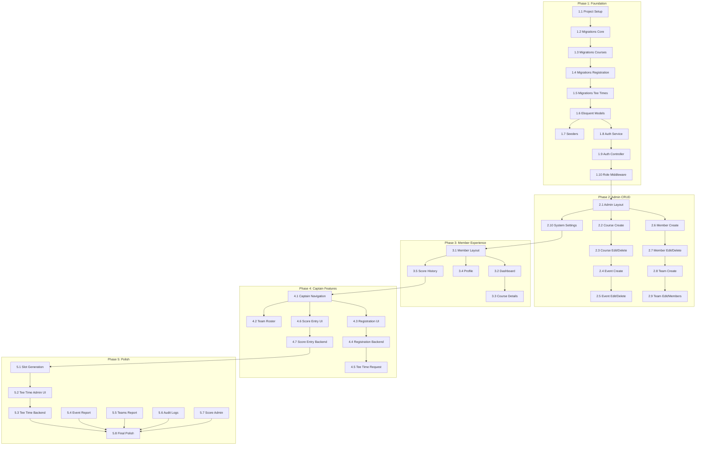

# MCSGA Golf Portal - Laravel Implementation Tasks

**Created:** 2026-01-23  
**Stack:** Laravel 11 + MySQL 8 + Tailwind CSS + Livewire  
**Reference:** [specs.md](../specs.md) v1.4, [laravel-implementation-plan.md](./laravel-implementation-plan.md)

---

## Task Overview

This document breaks down the implementation into discrete, actionable tasks organized by phase. Each task is designed to be:
- **Independently completable** - Can be finished in one work session
- **Testable** - Has clear acceptance criteria
- **Sequential** - Dependencies are explicit

---

## Phase 1: Foundation

### Task 1.1: Laravel Project Setup

**Description:** Create a new Laravel 11 project with all required dependencies and initial configuration.

**Acceptance Criteria:**
- [ ] New Laravel 11 project created with MySQL database connection
- [ ] Tailwind CSS installed and configured
- [ ] Laravel Breeze installed (Blade + Livewire stack)
- [ ] `spatie/laravel-permission` installed
- [ ] `spatie/laravel-activitylog` installed
- [ ] Git repository initialized with .gitignore
- [ ] Environment variables configured for local development
- [ ] Application runs without errors on `php artisan serve`

**Commands:**
```bash
composer create-project laravel/laravel mcsga-golf-portal
cd mcsga-golf-portal
composer require laravel/breeze --dev
php artisan breeze:install livewire
composer require spatie/laravel-permission
composer require spatie/laravel-activitylog
npm install && npm run build
```

**Files Created/Modified:**
- `composer.json`
- `.env`
- `config/app.php`
- `config/database.php`
- `tailwind.config.js`

---

### Task 1.2: Database Migrations - Core Entities

**Description:** Create migrations for core entities: members, teams, team_captains, and system_settings.

**Acceptance Criteria:**
- [ ] Migration for `members` table with all columns from spec
- [ ] Migration for `teams` table with all columns
- [ ] Migration for `team_captains` linking table
- [ ] Migration for `system_settings` table
- [ ] All migrations run without errors
- [ ] Foreign key constraints properly defined

**Spec Reference:** [specs.md Section 3.2.1-3.2.3, 3.2.14](../specs.md)

**Files Created:**
- `database/migrations/xxxx_create_members_table.php`
- `database/migrations/xxxx_create_teams_table.php`
- `database/migrations/xxxx_create_team_captains_table.php`
- `database/migrations/xxxx_create_system_settings_table.php`

---

### Task 1.3: Database Migrations - Courses and Events

**Description:** Create migrations for courses, course_photos, and events tables.

**Acceptance Criteria:**
- [ ] Migration for `courses` table with tee_time_interval field
- [ ] Migration for `course_photos` table
- [ ] Migration for `events` table with status, registration_deadline, tee_time_start
- [ ] All migrations run without errors
- [ ] Foreign key constraints properly defined

**Spec Reference:** [specs.md Section 3.2.4-3.2.6](../specs.md)

**Files Created:**
- `database/migrations/xxxx_create_courses_table.php`
- `database/migrations/xxxx_create_course_photos_table.php`
- `database/migrations/xxxx_create_events_table.php`

---

### Task 1.4: Database Migrations - Event Registration

**Description:** Create migrations for event registration workflow: registrations, participants, and guests.

**Acceptance Criteria:**
- [ ] Migration for `event_registrations` table
- [ ] Migration for `event_participants` table with unique constraint
- [ ] Migration for `event_guests` table
- [ ] All migrations run without errors
- [ ] Foreign key constraints properly defined

**Spec Reference:** [specs.md Section 3.2.7-3.2.9](../specs.md)

**Files Created:**
- `database/migrations/xxxx_create_event_registrations_table.php`
- `database/migrations/xxxx_create_event_participants_table.php`
- `database/migrations/xxxx_create_event_guests_table.php`

---

### Task 1.5: Database Migrations - Tee Times and Scores

**Description:** Create migrations for tee time slots, tee time requests, scores, and audit log.

**Acceptance Criteria:**
- [ ] Migration for `tee_time_slots` table with assignment_text
- [ ] Migration for `tee_time_requests` table with golfer_count and notes
- [ ] Migration for `scores` table with participant_id and guest_id
- [ ] Migration for `audit_log` table
- [ ] All migrations run without errors
- [ ] Foreign key constraints properly defined

**Spec Reference:** [specs.md Section 3.2.10-3.2.13](../specs.md)

**Files Created:**
- `database/migrations/xxxx_create_tee_time_slots_table.php`
- `database/migrations/xxxx_create_tee_time_requests_table.php`
- `database/migrations/xxxx_create_scores_table.php`
- `database/migrations/xxxx_create_audit_log_table.php`

---

### Task 1.6: Eloquent Models with Relationships

**Description:** Create Eloquent models for all tables with proper relationships defined.

**Acceptance Criteria:**
- [ ] Model created for each table (14 models total)
- [ ] All `belongsTo`, `hasMany`, `belongsToMany` relationships defined
- [ ] Fillable/guarded properties set
- [ ] Casts defined for date/time fields
- [ ] Soft delete trait added to Member and Team models

**Files Created:**
- `app/Models/Member.php`
- `app/Models/Team.php`
- `app/Models/TeamCaptain.php`
- `app/Models/Course.php`
- `app/Models/CoursePhoto.php`
- `app/Models/Event.php`
- `app/Models/EventRegistration.php`
- `app/Models/EventParticipant.php`
- `app/Models/EventGuest.php`
- `app/Models/TeeTimeSlot.php`
- `app/Models/TeeTimeRequest.php`
- `app/Models/Score.php`
- `app/Models/AuditLog.php`
- `app/Models/SystemSetting.php`

---

### Task 1.7: Database Seeder with Test Data

**Description:** Create seeders with realistic test data for development and testing.

**Acceptance Criteria:**
- [ ] Seeder creates 3 teams with 4-6 members each
- [ ] Seeder creates 2 courses with photos
- [ ] Seeder creates 1 upcoming event and 1 completed event
- [ ] Seeder creates sample registrations, participants, and guests
- [ ] Seeder creates 1 admin user, 3 team captains
- [ ] Seeder sets initial system settings (shared password)
- [ ] `php artisan db:seed` runs without errors

**Files Created:**
- `database/seeders/DatabaseSeeder.php`
- `database/seeders/MemberSeeder.php`
- `database/seeders/TeamSeeder.php`
- `database/seeders/CourseSeeder.php`
- `database/seeders/EventSeeder.php`

---

### Task 1.8: Authentication Service for Dual Password System

**Description:** Create a custom authentication service that handles both individual and shared passwords.

**Acceptance Criteria:**
- [ ] `AuthService` class created with `attemptLogin(email, password)` method
- [ ] Logic checks for individual password first, then shared password
- [ ] Shared password retrieved from system_settings table
- [ ] Password validation uses bcrypt
- [ ] Service properly integrated with Laravel's auth system
- [ ] Unit tests written for authentication logic

**Spec Reference:** [specs.md Section 2.3.1](../specs.md)

**Files Created:**
- `app/Services/AuthService.php`
- `tests/Unit/AuthServiceTest.php`

---

### Task 1.9: Custom Authentication Controller

**Description:** Modify the authentication flow to use the dual password system.

**Acceptance Criteria:**
- [ ] Login controller uses AuthService
- [ ] Single unified login form (email + password)
- [ ] Redirect to dashboard on success
- [ ] Error message on failure ("Invalid credentials")
- [ ] Session timeout set to 30 minutes
- [ ] Login/logout events logged to audit_log

**Files Modified:**
- `app/Http/Controllers/Auth/LoginController.php`
- `resources/views/auth/login.blade.php`
- `config/session.php`

---

### Task 1.10: Role-Based Middleware

**Description:** Create middleware for role-based access control (admin, captain, member).

**Acceptance Criteria:**
- [ ] Middleware `admin` restricts to administrators only
- [ ] Middleware `captain` restricts to captains and admins
- [ ] Middleware `member` allows all authenticated users
- [ ] Unauthorized access returns 403 or redirects to dashboard
- [ ] Roles determined from database (is_admin flag, team_captains table)

**Files Created:**
- `app/Http/Middleware/AdminMiddleware.php`
- `app/Http/Middleware/CaptainMiddleware.php`
- Registered in `bootstrap/app.php` or `app/Http/Kernel.php`

---

## Phase 1 Checkpoint: User Test 1

**Test Scenarios:**
1. Admin logs in with individual password
2. Captain logs in with individual password
3. Member logs in with shared password
4. Invalid credentials show error
5. Logout works correctly

---

## Phase 2: Core Admin CRUD

### Task 2.1: Admin Layout and Navigation

**Description:** Create the admin layout with sidebar navigation.

**Acceptance Criteria:**
- [ ] Admin layout extends base layout
- [ ] Sidebar with navigation links: Members, Teams, Events, Courses, Scores, Settings, Audit Logs
- [ ] Responsive design (hamburger menu on mobile)
- [ ] Admin dashboard page with summary stats
- [ ] Only visible to admin users

**Files Created:**
- `resources/views/layouts/admin.blade.php`
- `resources/views/admin/dashboard.blade.php`
- `resources/views/components/admin-nav.blade.php`

---

### Task 2.2: Course CRUD - List and Create

**Description:** Implement course listing and creation functionality.

**Acceptance Criteria:**
- [ ] Course list view with search
- [ ] Create course form with all fields per spec
- [ ] Tee time interval dropdown (8, 9, 10 minutes)
- [ ] Photo URL fields (up to 3)
- [ ] Form validation
- [ ] Success/error messages
- [ ] Audit log entry on create

**Spec Reference:** [specs.md Section 5.2.4](../specs.md)

**Files Created:**
- `app/Http/Controllers/Admin/CourseController.php`
- `app/Http/Requests/StoreCourseRequest.php`
- `resources/views/admin/courses/index.blade.php`
- `resources/views/admin/courses/create.blade.php`

---

### Task 2.3: Course CRUD - Edit and Delete

**Description:** Implement course editing and deletion with protection rules.

**Acceptance Criteria:**
- [ ] Edit course form pre-populated
- [ ] Update saves changes with audit log
- [ ] Delete button with confirmation modal
- [ ] Delete prevented if events reference course
- [ ] Appropriate error message if deletion blocked

**Spec Reference:** [specs.md Section 3.3 Deletion Rules](../specs.md)

**Files Created:**
- `resources/views/admin/courses/edit.blade.php`
- `app/Http/Requests/UpdateCourseRequest.php`

---

### Task 2.4: Event CRUD - List and Create

**Description:** Implement event listing and creation functionality.

**Acceptance Criteria:**
- [ ] Event list view with filters (status, date)
- [ ] Create event form with all fields
- [ ] Course selection dropdown
- [ ] Status dropdown (upcoming, active, completed, cancelled)
- [ ] Date pickers for event_date and registration_deadline
- [ ] Time picker for tee_time_start
- [ ] Form validation
- [ ] Audit log entry on create

**Spec Reference:** [specs.md Section 5.2.3](../specs.md)

**Files Created:**
- `app/Http/Controllers/Admin/EventController.php`
- `app/Http/Requests/StoreEventRequest.php`
- `resources/views/admin/events/index.blade.php`
- `resources/views/admin/events/create.blade.php`

---

### Task 2.5: Event CRUD - Edit and Delete

**Description:** Implement event editing and deletion with protection rules.

**Acceptance Criteria:**
- [ ] Edit event form pre-populated
- [ ] Status transitions allowed (upcoming → active → completed)
- [ ] Delete prevented if registrations or tee times exist
- [ ] Appropriate error message if deletion blocked

**Files Created:**
- `resources/views/admin/events/edit.blade.php`
- `app/Http/Requests/UpdateEventRequest.php`

---

### Task 2.6: Member CRUD - List and Create

**Description:** Implement member listing and creation functionality.

**Acceptance Criteria:**
- [ ] Member list view with search
- [ ] Create member form with all fields
- [ ] Team assignment dropdown
- [ ] Is Administrator checkbox
- [ ] Individual password field (optional)
- [ ] Form validation (email uniqueness)
- [ ] Audit log entry on create

**Spec Reference:** [specs.md Section 5.2.1](../specs.md)

**Files Created:**
- `app/Http/Controllers/Admin/MemberController.php`
- `app/Http/Requests/StoreMemberRequest.php`
- `resources/views/admin/members/index.blade.php`
- `resources/views/admin/members/create.blade.php`

---

### Task 2.7: Member CRUD - Edit and Delete

**Description:** Implement member editing and soft deletion.

**Acceptance Criteria:**
- [ ] Edit member form pre-populated
- [ ] Password field shows "Change password" option
- [ ] Soft delete sets is_active = false
- [ ] Soft-deleted members excluded from active lists
- [ ] Audit log entry on update/delete

**Spec Reference:** [specs.md Section 3.3 Deletion Rules](../specs.md)

**Files Created:**
- `resources/views/admin/members/edit.blade.php`
- `app/Http/Requests/UpdateMemberRequest.php`

---

### Task 2.8: Team CRUD - List and Create

**Description:** Implement team listing and creation functionality.

**Acceptance Criteria:**
- [ ] Team list view showing team name and member count
- [ ] Create team form with name and description
- [ ] Form validation
- [ ] Audit log entry on create

**Spec Reference:** [specs.md Section 5.2.2](../specs.md)

**Files Created:**
- `app/Http/Controllers/Admin/TeamController.php`
- `app/Http/Requests/StoreTeamRequest.php`
- `resources/views/admin/teams/index.blade.php`
- `resources/views/admin/teams/create.blade.php`

---

### Task 2.9: Team CRUD - Edit, Members, and Captains

**Description:** Implement team editing, member assignment, and captain designation.

**Acceptance Criteria:**
- [ ] Edit team form for name/description
- [ ] Member assignment interface (add/remove members from team)
- [ ] Captain designation interface (select from team members)
- [ ] Confirmation when reassigning member from another team
- [ ] Soft delete sets is_active = false

**Files Created:**
- `resources/views/admin/teams/edit.blade.php`
- `resources/views/admin/teams/members.blade.php`
- `app/Http/Requests/UpdateTeamRequest.php`

---

### Task 2.10: System Settings Page

**Description:** Implement system settings management including shared password.

**Acceptance Criteria:**
- [ ] System settings page showing all configurable settings
- [ ] Shared password change form with confirmation field
- [ ] Password properly hashed before storage
- [ ] Audit log entry on password change
- [ ] Success message after save

**Spec Reference:** [specs.md Section 5.3.6](../specs.md)

**Files Created:**
- `app/Http/Controllers/Admin/SystemSettingsController.php`
- `resources/views/admin/settings/index.blade.php`

---

## Phase 2 Checkpoint: User Test 2

**Test Scenarios:**
1. Create a new course with photos
2. Create a new event linked to course
3. Create 5 members with different roles
4. Create a team and assign members
5. Designate a captain
6. Change shared password

---

## Phase 3: Member Experience

### Task 3.1: Member Layout and Navigation

**Description:** Create the member-facing layout with navigation.

**Acceptance Criteria:**
- [ ] Member layout with header and profile icon
- [ ] Navigation: Home, My Profile, My Scores
- [ ] Captain menu items visible for captains
- [ ] Admin menu items visible for admins
- [ ] Responsive hamburger menu on mobile
- [ ] Logout button in header

**Files Created:**
- `resources/views/layouts/member.blade.php`
- `resources/views/components/member-nav.blade.php`

---

### Task 3.2: Member Dashboard

**Description:** Create the member dashboard showing upcoming events and recent scores.

**Acceptance Criteria:**
- [ ] Display upcoming events as cards
- [ ] Show team's assigned tee time (or "TBD")
- [ ] Link to course details from event cards
- [ ] Display recent scores section (last 3)
- [ ] Sort events by date (nearest first)
- [ ] "View All My Scores" link

**Spec Reference:** [specs.md Section 4.2.1](../specs.md)

**Files Created:**
- `app/Http/Controllers/Member/DashboardController.php`
- `resources/views/member/dashboard.blade.php`
- `resources/views/components/event-card.blade.php`

---

### Task 3.3: Course Details Page

**Description:** Create read-only course details page for members.

**Acceptance Criteria:**
- [ ] Display course name and description
- [ ] Photo gallery (carousel or grid)
- [ ] Address with Google Maps link (opens in new tab)
- [ ] Course-specific details section
- [ ] Back button to previous page

**Spec Reference:** [specs.md Section 4.3.3](../specs.md)

**Files Created:**
- `app/Http/Controllers/Member/CourseController.php`
- `resources/views/member/courses/show.blade.php`

---

### Task 3.4: Member Profile View and Edit

**Description:** Create profile view and edit functionality for members.

**Acceptance Criteria:**
- [ ] Profile page shows current info (name, email, phone, team)
- [ ] Edit form allows changing: first name, last name, phone
- [ ] Email change validates uniqueness
- [ ] Regular members cannot change admin status or password
- [ ] Save button persists changes
- [ ] Audit log entry on update

**Spec Reference:** [specs.md Section 4.3.1](../specs.md)

**Files Created:**
- `app/Http/Controllers/Member/ProfileController.php`
- `resources/views/member/profile/show.blade.php`
- `resources/views/member/profile/edit.blade.php`

---

### Task 3.5: Score History Page

**Description:** Create personal score history page for members.

**Acceptance Criteria:**
- [ ] Display list of member's scores from past events
- [ ] Show: event name, date, course, total score
- [ ] Sort by date (most recent first)
- [ ] "No scores recorded" message if empty
- [ ] Pagination if more than 20 scores

**Spec Reference:** [specs.md Section 4.2.1](../specs.md)

**Files Created:**
- `app/Http/Controllers/Member/ScoreController.php`
- `resources/views/member/scores/index.blade.php`

---

## Phase 3 Checkpoint: User Test 3

**Test Scenarios:**
1. Log in and view dashboard
2. Click through to view course details
3. Edit profile information
4. View score history
5. Navigate on mobile device

---

## Phase 4: Captain Features

### Task 4.1: Captain Navigation and Routes

**Description:** Set up captain-specific navigation and route protection.

**Acceptance Criteria:**
- [ ] Captains Menu visible for captains and admins
- [ ] Menu items: My Team, Register for Event, Request Tee Time, Enter Scores
- [ ] Routes protected by captain middleware
- [ ] Captain can only access their own team's data

**Files Modified:**
- `routes/web.php`
- `resources/views/components/member-nav.blade.php`

---

### Task 4.2: Team Roster Management

**Description:** Create team roster management for captains.

**Acceptance Criteria:**
- [ ] Display current team roster
- [ ] Add member to team (dropdown of available members)
- [ ] Confirmation dialog when reassigning from another team
- [ ] Remove member from team (sets team_id to NULL)
- [ ] Cannot remove self as captain
- [ ] Audit log entries for changes

**Spec Reference:** [specs.md Section 5.3.5](../specs.md)

**Files Created:**
- `app/Http/Controllers/Captain/TeamController.php`
- `resources/views/captain/team/index.blade.php`

---

### Task 4.3: Event Registration - Form UI

**Description:** Create the event registration form UI for captains.

**Acceptance Criteria:**
- [ ] Event dropdown (upcoming events team is not registered for)
- [ ] Checkbox list of team members to select
- [ ] "Add Member Guest" button with modal
- [ ] "Add Non-Member Guest" button with inline form
- [ ] Display selected participants and guests
- [ ] Register Team button

**Spec Reference:** [specs.md Section 5.3.1](../specs.md)

**Files Created:**
- `app/Http/Controllers/Captain/EventRegistrationController.php`
- `resources/views/captain/registration/create.blade.php`
- `app/Http/Livewire/EventRegistrationForm.php`

---

### Task 4.4: Event Registration - Backend Logic

**Description:** Implement the backend logic for event registration.

**Acceptance Criteria:**
- [ ] Validate at least one participant selected
- [ ] Validate registration deadline not passed
- [ ] Validate team not already registered
- [ ] Validate member guests not already registered elsewhere
- [ ] Create EVENT_REGISTRATION record
- [ ] Create EVENT_PARTICIPANTS records
- [ ] Create EVENT_GUESTS records
- [ ] Audit log entry
- [ ] Success message and redirect

**Files Created:**
- `app/Http/Requests/StoreEventRegistrationRequest.php`
- `app/Services/EventRegistrationService.php`

---

### Task 4.5: Tee Time Request Form

**Description:** Create the tee time request form for captains.

**Acceptance Criteria:**
- [ ] Event dropdown (events where team is registered)
- [ ] Display golfer count and names (read-only)
- [ ] Notes text area for special requests
- [ ] Submit creates request with pending status
- [ ] Display request status after submission
- [ ] Audit log entry

**Spec Reference:** [specs.md Section 5.3.2](../specs.md)

**Files Created:**
- `app/Http/Controllers/Captain/TeeTimeRequestController.php`
- `resources/views/captain/tee-times/create.blade.php`
- `resources/views/captain/tee-times/status.blade.php`

---

### Task 4.6: Score Entry Form - UI

**Description:** Create the score entry form UI for captains.

**Acceptance Criteria:**
- [ ] Event dropdown (completed events team participated in)
- [ ] List registered participants (members) with score input
- [ ] List registered guests with score input
- [ ] Numeric validation (40-250)
- [ ] Bulk save functionality
- [ ] Pre-populate existing scores

**Spec Reference:** [specs.md Section 5.3.4](../specs.md)

**Files Created:**
- `app/Http/Controllers/Captain/ScoreController.php`
- `resources/views/captain/scores/edit.blade.php`
- `app/Http/Livewire/ScoreEntryForm.php`

---

### Task 4.7: Score Entry Form - Backend Logic

**Description:** Implement the backend logic for score entry.

**Acceptance Criteria:**
- [ ] Validate all scores in range (40-250)
- [ ] Create or update SCORES records
- [ ] Set participant_id OR guest_id correctly
- [ ] Set entered_by to current user
- [ ] Audit log entries for each score
- [ ] Success message

**Files Created:**
- `app/Http/Requests/StoreScoresRequest.php`
- `app/Services/ScoreService.php`

---

## Phase 4 Checkpoint: User Test 4

**Test Scenarios:**
1. Register team for an event (select participants + guests)
2. Submit a tee time request
3. Enter scores for team after event
4. Add a new member to team
5. Remove a member from team

---

## Phase 5: Reports, Audit Logs, and Tee Time Admin

### Task 5.1: Tee Time Slot Auto-Generation

**Description:** Implement auto-generation of tee time slots for events.

**Acceptance Criteria:**
- [ ] Service generates slots from tee_time_start
- [ ] Uses course's tee_time_interval
- [ ] Stops at ~12:00 noon
- [ ] Creates TEE_TIME_SLOTS records
- [ ] Can regenerate if needed
- [ ] Called when admin opens tee time assignment page

**Spec Reference:** [specs.md Section 3.2.10](../specs.md)

**Files Created:**
- `app/Services/TeeTimeSlotService.php`

---

### Task 5.2: Tee Time Assignment Admin UI

**Description:** Create the tee time assignment interface for administrators.

**Acceptance Criteria:**
- [ ] Display pending requests sorted by requested_at (FIFO)
- [ ] Show team name, golfer count, golfer names
- [ ] Display total pending golfer count
- [ ] Display auto-generated slots in grid
- [ ] Freeform text area for each slot assignment
- [ ] Save All Assignments button
- [ ] Mark requests as assigned button

**Spec Reference:** [specs.md Section 5.3.3](../specs.md)

**Files Created:**
- `app/Http/Controllers/Admin/TeeTimeController.php`
- `resources/views/admin/tee-times/assign.blade.php`
- `app/Http/Livewire/TeeTimeAssignment.php`

---

### Task 5.3: Tee Time Assignment Backend

**Description:** Implement backend logic for tee time assignment.

**Acceptance Criteria:**
- [ ] Save assignment_text for each slot
- [ ] Update request status to "assigned"
- [ ] Set assigned_at and assigned_by on slots
- [ ] Audit log entries
- [ ] Success message

**Files Created:**
- `app/Http/Requests/UpdateTeeTimeSlotsRequest.php`

---

### Task 5.4: Event Scoring Report

**Description:** Create the event scoring report for administrators and captains.

**Acceptance Criteria:**
- [ ] Event selection dropdown
- [ ] Display all scores with team, name, score, type (member/guest)
- [ ] Default sort: team name A-Z, then member name
- [ ] Sort toggles: by score, by name
- [ ] Show total participants and average score
- [ ] Captains can only view reports for their team's events

**Spec Reference:** [specs.md Section 6.1](../specs.md)

**Files Created:**
- `app/Http/Controllers/Admin/ReportController.php`
- `resources/views/admin/reports/event-scores.blade.php`

---

### Task 5.5: Teams and Members Report

**Description:** Create the teams and members report for administrators.

**Acceptance Criteria:**
- [ ] List all teams sorted A-Z by name
- [ ] Show members per team sorted A-Z
- [ ] Indicate captains with asterisk
- [ ] Show member count per team
- [ ] Show totals at bottom

**Spec Reference:** [specs.md Section 6.2](../specs.md)

**Files Created:**
- `resources/views/admin/reports/teams-members.blade.php`

---

### Task 5.6: Audit Log Viewer

**Description:** Create the audit log viewer for administrators.

**Acceptance Criteria:**
- [ ] Paginated list of audit log entries
- [ ] Filter by date range
- [ ] Filter by user
- [ ] Filter by action type
- [ ] Show: timestamp, user, action, table, record ID, details
- [ ] Sortable columns

**Spec Reference:** [specs.md Section 7](../specs.md)

**Files Created:**
- `app/Http/Controllers/Admin/AuditLogController.php`
- `resources/views/admin/audit-logs/index.blade.php`

---

### Task 5.7: Admin Score Management

**Description:** Implement full CRUD for scores in admin area.

**Acceptance Criteria:**
- [ ] Score list view with filters (event, team, member)
- [ ] Create score: select event, participant, enter score
- [ ] Edit existing scores
- [ ] Delete scores with confirmation
- [ ] Audit log entries for all changes

**Spec Reference:** [specs.md Section 5.2.5](../specs.md)

**Files Created:**
- `app/Http/Controllers/Admin/ScoreController.php`
- `resources/views/admin/scores/index.blade.php`
- `resources/views/admin/scores/create.blade.php`
- `resources/views/admin/scores/edit.blade.php`

---

### Task 5.8: Final Polish and Testing

**Description:** Final review, testing, and polish before launch.

**Acceptance Criteria:**
- [ ] All forms have consistent styling
- [ ] Loading states on all forms
- [ ] Success/error flash messages throughout
- [ ] Mobile responsiveness reviewed on real devices
- [ ] Performance optimization (eager loading queries)
- [ ] Database indexes added for common queries
- [ ] All user stories from spec pass manual testing

---

## Phase 5 Checkpoint: User Test 5 (Pre-Launch)

**Test Scenarios:**
1. Full event lifecycle (create → register → request tee time → assign → enter scores → view report)
2. Edge cases: cancelled events, deleted members
3. Mobile testing
4. Performance testing with 50 concurrent users

---

## Appendix: Task Dependencies



---

## Quick Reference

| Phase | Tasks | Dependencies |
|-------|-------|--------------|
| Phase 1 | 1.1 - 1.10 | None |
| Phase 2 | 2.1 - 2.10 | Phase 1 complete |
| Phase 3 | 3.1 - 3.5 | Phase 2 complete |
| Phase 4 | 4.1 - 4.7 | Phase 3 complete |
| Phase 5 | 5.1 - 5.8 | Phase 4 complete |

**Total Tasks:** 39 implementation tasks + 5 user testing checkpoints

---

*This task breakdown should be used in conjunction with the [Laravel Implementation Plan](./laravel-implementation-plan.md) and [specs.md](../specs.md) v1.4.*
